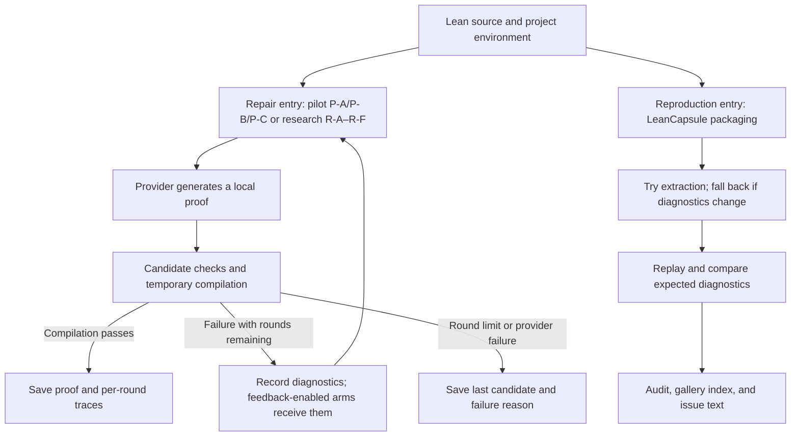

# TRACER

**English** | [简体中文](README.zh-CN.md)

### Typed Repair Agent with Compiler-validated Example Retrieval

**Feedback-driven Lean proof repair. Replayable failures. Evidence-backed experiments.**

[](https://github.com/runqi-allen-wang/TRACER-Typed-Repair-Agent-with-Compiler-validated-Example-Retrieval/actions/workflows/ci.yml)
[](lean-toolchain)
[](.github/workflows/ci.yml)

[Latest results](#latest-published-results) · [Quick start](#quick-start) · [Naming](#experiment-and-policy-namespaces) · [Design contributions](#design-contributions) · [Compiler Feedback v1](docs/COMPILER_FEEDBACK_V1.md) · [API guide](docs/API_GUIDE.md) · [Failure gallery](capsules/index.md) · [Contributing](CONTRIBUTING.md)


TRACER is a **research toolkit for Lean 4 proof repair, failure reproduction, and evaluation**. It connects language-model candidates, Lean compiler feedback, local example retrieval, and per-round experiment records. Its **LeanCapsule** component packages failures into shareable, replayable, and auditable artifacts.

The project offers two complementary workflows: reproduce an error with LeanCapsule, **without a model API**, or connect a real provider to run bounded proof repair. Public documentation names the published smoke-pilot conditions P-A/P-B/P-C while preserving their historical machine values A/B/C; the current repair24 protocol exposes six separate research arms, R-A through R-F. Both workflows share compilation and diagnostic infrastructure, but have separate entry points and acceptance criteria.

> **Research scope:** TRACER does not train or fine-tune models. It focuses on inference-time feedback, local repair, and reproducible experiment and failure artifacts, providing replaceable, inspectable infrastructure for method research.

## Experiment and policy namespaces

TRACER uses three deliberately separate namespaces. They describe different evidence layers and must not be counted as one flat sequence of experimental groups.

| Namespace | Members | Purpose | Current evidence state |
| --- | --- | --- | --- |
| **Published pilot conditions** | P-A / P-B / P-C | Historical 18-problem smoke test: theorem only; compiler feedback; feedback plus static retrieval. Stored as A/B/C | Published 18 × 3 real-provider batch with traces, proofs, and manual review |
| **Research arms** | R-A / R-B / R-C / R-D / R-E / R-F | repair24 protocol for separating feedback, retrieval, error-adaptive queries, and failure-context reuse | Runner, budgets, frozen tasks, and offline gates exist; the full multi-model repeated matrix is pending |
| **Security policies** | SP-1 through SP-12 | Versioned pre-compilation policies plus benign controls for candidates that may violate the trust boundary | Twelve dangerous fixtures and eight benign controls form an offline gate; this is not a complete sandbox or a seventh research arm |

The current research-arm map is:

- **R-A:** theorem only; **R-B:** compiler feedback without retrieval.
- **R-C:** static retrieval plus feedback; **R-D:** retrieval only, with no diagnostic feedback returned to generation.
- **R-E:** feedback plus error-adaptive retrieval queries; **R-F:** R-E plus reusable public failure-capsule context.

Machine-facing values remain `A/B/C/D/C_dynamic/C_failure` for compatibility with existing scripts and records. Public research discussion should use R-A through R-F. Security cases use SP identifiers exclusively; the current [SP-1–SP-12 suite](docs/security_policy.md) measures twelve frozen dangerous cases against eight benign controls before Lean compilation.

Available artifacts:

- **24 public failure capsules**, spanning four error families and Std, Mathlib, and project-local dependencies.
- **A 12-core / 4-challenge feasibility experiment** whose 16 cases preserve normalized diagnostics and replay in clean temporary directories, including project-local multi-file cases.
- **Compiler Feedback v1 and Feedback Adoption v1**, covering the frozen three-layer diagnostic protocol, 15 failure/infrastructure fixtures, candidate-change observations, cache separation, and static-versus-dynamic query/Top-k change metrics. The latest published evidence consists of two audited 216-task runs: [DeepSeek Pro](published/feedback-study-8ccb89dd-3e26-47f0-8eae-d1930b95e248) with 199 successful proofs and [DeepSeek Flash](published/feedback-study-562ad440-3446-4138-801e-59726ed0e108) with 209, plus a complete [task-paired comparison](published/feedback-cross-model-8ccb89dd-562ad440). Both ledgers are explicitly AI-assisted.
- **Causal Feedback v1, Error-State Graph, and Adaptive Router prototypes** freeze one first-round candidate before branching into content-free retry, true feedback, category-matched irrelevant feedback, counterfactual feedback, retrieval-only, and adaptive arms. A machine-readable project-level pilot is now [preregistered](experiments/preregistrations/tracer_real_causal_v1.json); no formal causal claim has been published. See the [protocol](docs/CAUSAL_FEEDBACK_V1.md).
- **TRACER-REAL v1** contains 11 verified public-history repairs from three independent upstream projects: Mathlib for development, Batteries for validation, and Aesop for held-out test. Every task keeps the theorem statement fixed, reproduces the historical proof failure in the pinned environment, and recompiles the repair. Reference proofs stay outside the public task directory. This is a project-split pilot, not a large effectiveness benchmark.
- **A historical 18-problem smoke pilot**, retained as engineering evidence for the provider-to-compiler pipeline but no longer treated as the headline experiment.
- **An end-to-end workflow** covering a single-problem CLI, local HTTP API, batch evaluation, manual review, report validation, and sanitized export.
- **A separate six-arm repair24 research suite (R-A through R-F)** with retrieval-only, diagnostic-query and failure-context controls. The runner and offline checks exist; the full multi-model repeated experiment is pending. Jump to [research evaluation](#research-evaluation-beyond-the-smoke-test) and [related work](#related-work).

These artifact counts are not evidence of general theorem-proving ability or superior performance; experimental limitations are discussed below.

Both README versions provide a full overview and runnable examples. Most linked detailed guides are currently in Chinese.

## Why TRACER?

Repairing a Lean proof raises three distinct questions:

1. **Why did it fail?** An unresolved name, type mismatch, failed instance synthesis, or unfinished goal?
2. **Can someone else reproduce it?** An error screenshot or proof fragment rarely captures the toolchain, imports, and local context.
3. **Does an improvement actually help?** Success rates should be traceable to problems, model settings, candidates, compiler diagnostics, and final proofs—not just terminal output.

TRACER treats these questions separately and connects them through readable records. Developers get repair artifacts they can recompile; researchers get evidence for inspecting experimental settings and failures; collaborators get replayable error cases.

## Design contributions

These are verifiable engineering contributions and a combination of design choices, not claims to have invented compiler feedback, retrieval augmentation, or automated theorem proving.

| Design focus | Implementation | Value |
| --- | --- | --- |
| **Failures as first-class artifacts** | LeanCapsule stores Lean files, environment information, expected diagnostics, provenance, and replay entry points | Share, reproduce, and retain errors as regression cases without relying on the original terminal session |
| **Compiler-checked case extraction** | Recompile extracted theorems, fall back to the full file if diagnostics change, and attempt import removal within a budget | Check that a smaller case preserves the failure instead of equating shorter files with successful reproduction |
| **Controlled inference-time repair** | Local generation → candidate checks → compilation in the project environment → bounded feedback, for at most three rounds | Study feedback and examples without changing model weights or overwriting the original problem |
| **Auditable compiler feedback** | Preserve raw, normalized, and structured diagnostics together; every extracted category and signal points to an exact raw excerpt | Support offline inspection of diagnostic transformations before testing whether a model uses them |
| **Observable feedback adoption** | Compare adjacent candidates with prior diagnostic signals, separate cache reuse, and record query/Top-k changes for dynamic retrieval | Distinguish recorded behavioral changes from unsupported claims that a model causally understood feedback |
| **Same-seed diagnostic interventions** | Freeze one failed first-round candidate, then branch into true, irrelevant, counterfactual, retrieval-only, and adaptive conditions | Separate feedback content from resampling and expose susceptibility to misleading diagnostics |
| **Traceable experimental evidence** | Record model settings, candidates, actual retrieved examples, usage, and diagnostics; save proofs; validate before formal reporting | Reduce the risk of mistaking mixed batches, cache reuse, or infrastructure errors for improved model capability |

Implementation: [repair loop](src/agent.py) · [Compiler Feedback v1](docs/COMPILER_FEEDBACK_V1.md) · [feedback-adoption audit](docs/FEEDBACK_ADOPTION_V1.md) · [three-representation study](docs/FEEDBACK_STUDY_V1.md) · [same-seed causal protocol](docs/CAUSAL_FEEDBACK_V1.md) · [SP security suite](docs/security_policy.md) · [capsule packaging](src/leancapsule/pack.py) · [pilot validation](scripts/validate_pilot.py).

## How it works



The two entry points work independently. The Agent does not automatically turn every failed attempt into a capsule. To add a failure to the gallery, explicitly run `pack` and supply provenance and review information.

**“Success” has two different meanings:**

- **Agent success:** a candidate passes Lean compilation and the project's incomplete-proof checks.
- **Capsule replay success:** the observed compilation status, diagnostic category, and normalized diagnostic text match expectations. For a case expected to fail compilation, reproducing that failure is a successful replay.

Thus, 24/24 gallery replays do not mean that a model solved 24 proofs, and must not be conflated with either the published P-A/P-B/P-C pilot or R-A through R-F repair outcomes.

## Who is it for?

- **Lean users and maintainers:** attach errors with environment details and reproduction steps to issues.
- **Formal mathematics and AI4Math researchers:** reuse frozen problems, prompt templates, and per-round traces to compare inference-time feedback strategies.
- **Agent developers:** replace the generation backend through the provider interface and judge repairs by compilation rather than model self-reports.
- **Courses and small research teams:** start with API-free failure replay, then move to real-model experiments and manual review.

## Quick start

### 1. Prepare the environment

Install Python, Git, and the Lean toolchain manager first. Ensure `python`, `lean`, and `lake` are available in your terminal. The repository's [lean-toolchain](lean-toolchain) pins Lean 4.32.0; CI uses Python 3.11. Installing Python dependencies does not install Lean.

To clone the repository:

```bash
git clone https://github.com/runqi-allen-wang/TRACER-Typed-Repair-Agent-with-Compiler-validated-Example-Retrieval.git tracer
cd tracer
```

If you already have a checkout, enter its root directory. These single-line commands work in both PowerShell and Git Bash:

```text
python -m pip install -r requirements.txt
lake build
```

If PowerShell cannot locate `ELAN_HOME`, set the existing toolchain directory for the current terminal and retry:

```powershell
$env:ELAN_HOME = "$env:USERPROFILE\.elan"
```

### 2. Replay a failure without an API

```text
python -m leancapsule replay capsules/std/unknown-identifier
```

This case is expected to produce an unknown-identifier error. `ok: true` in the JSON output means **the expected error was reproduced**, not that the source compiled successfully.

You can also package a supplied failing input into a new capsule. This example writes to `results/` without overwriting public cases:

```text
python -m leancapsule pack --project . --file examples/capsule_failures/unknown_identifier.lean --lines 1:7 --out results/capsules/unknown-identifier
python -m leancapsule replay results/capsules/unknown-identifier
python -m leancapsule issue results/capsules/unknown-identifier --out results/capsules/unknown-identifier/issue.md
```

A newly generated capsule is a local reproduction artifact. Before publication, add classification, provenance, license information, and manual review. Successful `pack` execution does not imply a passed release audit. See the [LeanCapsule artifact format](docs/CAPSULE_FORMAT.md).

### 3. Check the repair workflow without an API

```text
python src/agent.py solve --file lean_project/Benchmarks/Evaluation18.lean --theorem Eval18.and_swap_eval --condition B --provider mock --mock-candidate "by intro h; exact And.intro h.right h.left"
```

The `mock` provider only tests patching, compilation, and saving. Its candidate is supplied by the user and **is not a model experiment result**. Targets may use `-- PROOF_START` / `-- PROOF_END` markers or a unique `sorry` placeholder inside the target theorem. Successful files go to `results/solutions/`; the original file remains unchanged.

## Connecting real models

The [model API guide](docs/API_GUIDE.md) covers DeepSeek V4 Pro/Flash, OpenAI GPT, environment variables, PowerShell / Git Bash, the local HTTP interface, and troubleshooting.

The built-in `openai_compatible` provider supports both **Chat Completions** and the **Responses API**. Responses mode is selected with `--wire-api responses`; reasoning effort and response storage are explicit controls. The model name, endpoint, and key must still belong to the same service.

### DeepSeek

```text
python src/agent.py solve --file lean_project/Benchmarks/Evaluation18.lean --theorem Eval18.and_swap_eval --condition B --provider openai_compatible --api-url "https://api.deepseek.com/chat/completions" --model deepseek-v4-pro --temperature 0 --max-tokens 12000 --api-key-prompt --max-rounds 3 --timeout 60
```

### OpenAI GPT

```text
python src/agent.py solve --file lean_project/Benchmarks/Evaluation18.lean --theorem Eval18.and_swap_eval --condition B --provider openai_compatible --api-url "https://api.openai.com/v1/chat/completions" --model gpt-4.1 --temperature 0 --max-tokens 4000 --api-key-prompt --max-rounds 3 --timeout 60
```

Key input is hidden; after reading it, the CLI displays only its length and last four characters. Never put a full key in scripts, a README, commit messages, or issues. Real API calls may incur charges.

For DeepSeek Flash, change the model to `deepseek-v4-flash`. GPT-4.1 is a compatibility example for the current request structure, not a recommendation of the latest model; do not assume GPT-5 variants accept identical parameters. The examples use different output budgets and are not an equal-budget comparison. DeepSeek ignores temperature in thinking mode; see the API guide for restrictions and official references.

Other interfaces:

- **Command provider:** use `--provider command --provider-command ...` to connect a custom generation program. Input/output conventions are in the API guide.
- **Local HTTP API:** run `python src/api_server.py --host 127.0.0.1 --port 8765` and send JSON configuration to `POST /solve`. This is not an authenticated public service; use it only in a trusted local environment.

### Diagnosing failures

- `provider_error` means the request did not produce a candidate for Lean compilation. Check the endpoint, model, key, quota, or network.
- Compiler diagnostics such as `diagnostic.category = syntax/type/goal` mean a candidate reached compilation; they do not by themselves indicate a broken API.
- `compile_ok: false` alone does not mean the API is broken; read `diagnostic` as well.
- Candidate normalization removes Markdown code fences before compilation, including fences in historical cached candidates.

Single-problem candidates, model usage, cache hits, and compiler diagnostics are recorded in `results/agent_runs.jsonl`. Successful proofs go to `results/solutions/`; the last candidate after persistent failure goes to `results/solutions/failures/`.

## Latest published results

The current headline evidence is the frozen **Compiler Feedback Study v1** on [repair24-v1](benchmarks/repair24/manifest.json): 24 repair tasks × three feedback representations × three repeats = **216 task instances per model**. Both releases use a three-round budget, preserve per-round compiler evidence, save every successful proof, independently recompile the exported proofs, and label their review ledgers as AI-assisted.

| Model-family run | Feedback representation | Tasks | pass@1 | Success within three rounds |
| --- | --- | ---: | ---: | ---: |
| DeepSeek Pro | Raw | 72 | 56/72 (77.8%) | 67/72 (93.1%) |
| DeepSeek Pro | Normalized | 72 | 56/72 (77.8%) | 65/72 (90.3%) |
| DeepSeek Pro | Structured | 72 | 60/72 (83.3%) | 67/72 (93.1%) |
| DeepSeek Flash | Raw | 72 | 67/72 (93.1%) | 69/72 (95.8%) |
| DeepSeek Flash | Normalized | 72 | 63/72 (87.5%) | 69/72 (95.8%) |
| DeepSeek Flash | Structured | 72 | 66/72 (91.7%) | **71/72 (98.6%)** |

The Pro release contains **283 sanitized round records, 199 successful proofs, and 1,538,045 recorded tokens**. The Flash replication contains **245 round records, 209 successful proofs, and 948,466 recorded tokens**. All 408 exported proofs passed an additional independent compilation audit. Monetary cost remains unknown because a frozen price schedule was not part of either release.

The complete task-paired final-outcome agreement between Pro and Flash is 94.4% for raw, 88.9% for normalized, and 91.7% for structured feedback. Flash + structured feedback is the highest observed row in these releases, but this is **descriptive evidence within one provider family**. The two model configurations differ in explicit reasoning controls, and the study does not establish statistical significance, a causal advantage for structured feedback, cross-provider generalization, or state-of-the-art performance.

**Inspect the evidence:** [Pro release](published/feedback-study-8ccb89dd-3e26-47f0-8eae-d1930b95e248) · [Flash release](published/feedback-study-562ad440-3446-4138-801e-59726ed0e108) · [paired comparison](published/feedback-cross-model-8ccb89dd-562ad440) · [protocol](docs/FEEDBACK_STUDY_V1.md) · [replication contract](docs/SECOND_MODEL_REPLICATION.md).

### Current evidence at a glance

| Scope | Current repository evidence |
| --- | --- |
| Compiler feedback | Two audited 216-task model-family runs, 408 independently recompiled proofs, AI-assisted review ledgers, and a complete paired comparison |
| LeanCapsule | A reviewed 24-case gallery across Std, Mathlib, and project-local dependencies, plus 12-core / 4-challenge feasibility artifacts |
| Security | [SP-1–SP-12 with eight benign controls](published/security-study-tracer-sp-v2); dangerous-candidate false acceptance 0/12 and benign-control false rejection 0/8 in the frozen suite. [SP isolation v1](docs/SP_ISOLATION_V1.md) freezes fourteen Docker/low-privilege controls, but a native Linux execution report has not yet been published |
| Project-level causal pilot | [TRACER-REAL v1](benchmarks/real_repairs/tracer_real_v1/manifest.json): 11 verified repairs across three project-disjoint splits; the Aesop test project and the unique structured-vs-content-free primary contrast are frozen in a [machine-readable preregistration](experiments/preregistrations/tracer_real_causal_v1.json). Provider output is not a result until the run and audit complete |
| Broader repair study | The R-A–R-F repair24 benchmark, runner, budget controls, and offline gates are implemented; the full six-arm repeated provider experiment has not been run |

Passing a software gate, compiling a proof, completing a declared review mode, and establishing a research effect are different claims. TRACER does not promote one into another. The canonical dated evidence register is [PROGRESS.md](PROGRESS.md).

### Earlier work

The original 18-problem P-A/P-B/P-C provider pilot is retained as an engineering smoke test for the provider → compiler → proof export pipeline; its first-attempt ceiling prevents a feedback-gain claim. Earlier FATE-M handoffs, an R-B preflight, and local Windows/WSL or timing notes remain available for traceability, but they are not the headline result and some lack the raw artifacts required for independent verification. See [PROGRESS.md](PROGRESS.md) for evidence status, [CHANGELOG.md](CHANGELOG.md) for history, and the [real-pilot guide](docs/REAL_PILOT_GUIDE.md) for reproduction commands.

## LeanCapsule failure gallery

LeanCapsule provides a **failure-reproduction protocol centered on diagnostic consistency**. It retains human-readable error text and a readable diagnostic key with local paths, line/column positions, and unstable identifiers removed. Matching normalized text is an operational reproduction criterion, not a claim of mathematical or program equivalence between files.

The current [gallery](capsules/index.md) contains 24 cases:

| Error family | Cases | Typical issues |
| --- | ---: | --- |
| Name / import | 7 | Unknown identifiers, namespaces, or missing imports |
| Type / application | 5 | Type mismatches, function application, or implicit arguments |
| Elaboration / instance | 5 | Instance synthesis, metavariables, or coercions |
| Goal / scope | 7 | Unsolved goals, local context, or scope |

Sources: **Std 14 · Mathlib 4 · project-local 6**. Indexes are available as [JSON](capsules/index.json), [CSV](capsules/index.csv), and [Markdown](capsules/index.md). The [review ledger](capsules/MANUAL_REVIEW.csv) records provenance, semantic checks, and sensitive-content review.

The separate [12-core / 4-challenge feasibility experiment](docs/CAPSULE_FEASIBILITY.md) checks a balanced four-taxonomy × three-context core matrix and four harder cases. All 16 cases preserved the full ordered normalized diagnostics and replayed after copying into fresh temporary directories. Project-local imports are copied as a bounded source closure and rebuilt from source before replay; compiled `.olean`/`.ilean` artifacts are not packaged.

Packaging with `--theorem` attempts a standalone file containing imports, namespaces, and the target theorem. If compilation status or normalized diagnostics change, it falls back to the full file. Validated standalone files then undergo import minimization within a compilation budget; disable this with `--no-minimize-imports`. The `--lines` range records the target and is not a general semantic slicing feature.

### Mathlib environment

Mathlib cases use the separate [mathlib_project](mathlib_project) dependency project. Prepare its pinned dependencies before the first replay:

```powershell
./scripts/setup_mathlib.ps1
```

On Linux/macOS:

```bash
bash scripts/setup_mathlib.sh
```

Dependencies and precompiled caches are not committed. The Bash setup script retries dependency synchronization and cache downloads up to three times, waiting 5 and 10 seconds between attempts. Before retrying synchronization, it moves incomplete Git package clones with no valid HEAD into `.lake/retry-backups/`; valid repositories, linked packages, and non-Git local dependencies are left intact. Failed attempts retain their error output, and exhausting retries still fails CI. The CI setup step has a 30-minute limit; no certificate checks are disabled.

For Bash setup, `TRACER_SETUP_ATTEMPTS` (1–5) and `TRACER_SETUP_RETRY_DELAY` (0–30 initial seconds) control retries. `MATHLIB_CACHE_DIR` defaults to the project's `.lake/mathlib-cache`, unless explicitly set. These retry settings apply to the Bash entry point, not the PowerShell script. On Windows, use `$env:ELAN_HOME = "$env:USERPROFILE\.elan"`, including the separator before `.elan`. Configure `HTTP_PROXY` / `HTTPS_PROXY` only if you need a local proxy.

Without network access or prepared Mathlib dependencies, start with Std and project-local cases. This does not validate the Mathlib cases. The default replay timeout is 180 seconds.

## Tests and quality checks

These checks do not call paid model APIs, but end-to-end tests require a real Lean toolchain:

```text
lake build
python scripts/run_capsule_feasibility.py --verify-only
python scripts/run_ci_tests.py
python -m leancapsule audit capsules
```

After preparing Mathlib dependencies, replay the full gallery:

```text
python -m leancapsule verify capsules
```

To regenerate the index:

```text
python -m leancapsule gallery capsules --out capsules/index.json
```

The [CI workflow](.github/workflows/ci.yml) installs the toolchain, builds Lean, runs Python checks and tests, audits releases, prepares Mathlib dependencies, and replays the full gallery. Its badge links to actual Actions runs instead of displaying a fixed “all passed” claim.

Keep these checks distinct:

- `audit` checks layout, schema, provenance and licenses, sensitive information, incomplete proofs, and the review ledger. It **does not replace compilation replay**.
- `verify` checks whether expected failures reproduce. It **does not replace real-model evaluation**.
- `validate_pilot.py` and review records check experimental deliverables. They **do not replace substantive inspection of mathematical assumptions and example leakage**.

## Safety and scope

- **Not yet an operating-system sandbox.** Temporary HOME/TMP/APPDATA directories, minimal environment variables, and candidate policies remain defense layers. A Docker/low-privilege [isolation protocol](docs/SP_ISOLATION_V1.md) now freezes non-root execution, read-only mounts, no network, dropped capabilities, seccomp and resource limits, but the current development machine has no Docker and no real container report has been published.
- **Local repair only.** The Agent must not rewrite imports or theorem headers. Candidates containing `sorry`, `admit`, `sorryAx`, unfinished-proof warnings, unsafe declarations, explicit metaprogramming entry points, or injected commands are rejected. SP-1–SP-12 cover twelve frozen risk examples, while eight benign controls are policy-checked and independently compiled to measure false rejection. Observed false acceptance and false rejection are both zero in this frozen suite, but their Wilson 95% upper bounds are about 24.3% and 32.4%; zero observations are not zero risk. SP identifies a non-experimental security policy, so it cannot be confused with research arm R-D. Text rules cannot be assumed to detect every Lean metaprogramming construct.
- **Separate credentials from releases.** The provider restricts cross-origin redirects and sanitizes errors; keys are not experiment-record fields. Still inspect exports and send keys only to trusted providers.
- **Readable comparisons and caching.** Diagnostic comparisons and request caching use normalized readable text and do not create opaque derived identifiers. Cache reuse is for local debugging, not independent real sampling.
- **Extraction is not global minimization.** Full-file fallback and explicit local-file manifests are not arbitrary multi-file program slicing. Diagnostic consistency does not guarantee preservation of every contextual meaning.
- **Implemented infrastructure, unproven generalization.** The toolkit and published pilot do not replace larger, harder, multi-model, repeated experiments. The current retriever is not a learned premise-selection model.

## Documentation and repository map

| Goal | Start here |
| --- | --- |
| Configure DeepSeek, GPT, or a custom provider | [API guide](docs/API_GUIDE.md) |
| Run, review, and export real experiments | [Pilot guide](docs/REAL_PILOT_GUIDE.md) |
| Compare raw/normalized/structured compiler feedback with DeepSeek | [Feedback Study v1 live CLI](docs/FEEDBACK_STUDY_V1.md) |
| Reproduce Feedback Study v1 with a second model | [Second-model replication protocol](docs/SECOND_MODEL_REPLICATION.md) |
| Inspect the same-first-candidate causal protocol and adaptive router | [Causal Feedback v1](docs/CAUSAL_FEEDBACK_V1.md) |
| Inspect or rebuild the project-split real-history benchmark | [TRACER-REAL v1 and builder](benchmarks/real_repairs/README.md) |
| Understand condition controls and validity constraints | [Methodology](docs/methodology.md) |
| Look up per-round record fields | [JSONL format](docs/jsonl_schema.md) |
| Inspect or verify the three-layer compiler-diagnostic protocol | [Compiler Feedback v1](docs/COMPILER_FEEDBACK_V1.md) |
| Create publicly shareable failure artifacts | [Artifact format](docs/CAPSULE_FORMAT.md) and [case contribution guide](docs/CONTRIBUTING_CAPSULES.md) |
| Run or inspect the AxProverBase Part 1 + Part 2 experiment | [Part 1 guide](baseline/README.md), [Part 2 design](docs/part2_capsule_feedback.md), [Part 3 handoff checklist](docs/part3_experiment_handoff.md), and [result handoff](results/handoff/part12-live-20260828-corrected/README.md) |
| Inspect the Experience + CapsuleFeedback confound arm | [B arm design and result](docs/part2_capsule_feedback_confound_arm.md) and [B arm handoff](results/handoff/part2-experience-capsule-20260829/REPORT.md) |
| Inspect the SP-1–SP-12 pre-compilation suite | [Security-policy regression and threat model](docs/security_policy.md) and [frozen SP v2 report](published/security-study-tracer-sp-v2) |
| Plan or run the SP container/low-privilege probe | [SP isolation v1 protocol](docs/SP_ISOLATION_V1.md) |
| Inspect the 12-core / 4-challenge clean-replay experiment | [Capsule feasibility report](docs/CAPSULE_FEASIBILITY.md) |
| Inspect published experiments and proofs | [Pilot release](published/pilot-20260826T122354Z-d628742d) |
| Check current status and past changes | [PROGRESS](PROGRESS.md) and [CHANGELOG](CHANGELOG.md) |

```text
src/agent.py           Proof repair loop and single-problem CLI
src/provider.py        Model interface and candidate parsing
src/compiler.py        Lean compilation and local proof patching
src/retriever.py       Local example retrieval and overlap checks
src/causal_feedback.py Same-first-candidate diagnostic interventions
src/error_state_graph.py Source-linked diagnostic state representation
src/adaptive_router.py Deterministic budget-aware routing prototype
src/real_repairs.py    Real-history repair-task builder
src/leancapsule/       Packaging, extraction, replay, audit, and issues
capsule_schema/        Capsule manifest schema
capsules/              Public failures, indexes, and review ledger
examples/              Local retrieval examples and failing inputs
benchmarks/            Frozen problem metadata
lean_project/          Lean problems and local-dependency cases
mathlib_project/       Separate Mathlib dependency project
prompts/               A/B/C/D context-strategy prompt templates
scripts/               Dependency setup, tests, pilot validation, and export
baseline/              AxProverBase Part 1 and paired Part 2/B experiment runners
configs/               Frozen AxProverBase model and memory configurations
tests/                 Automated tests
results/               Local run data and reports
published/             Reviewed, sanitized experimental releases
docs/                  Usage guides and research methodology
```

## Research status and next validation

The two published Compiler Feedback v1 runs are the repository's current primary model evidence. The broader [R-A–R-F protocol](docs/RESEARCH_PROTOCOL.md) remains a separate, not-yet-run experiment: it is designed to isolate feedback, retrieval-only context, error-adaptive queries, and reusable failure-capsule context. Its runner and offline checks are available, but configuration files and dry-run plans are not results.

The next evidence priorities are:

1. run and audit the preregistered TRACER-REAL project-level causal pilot without changing the frozen test project or primary contrast;
2. expand TRACER-REAL to at least five genuinely held-out projects and 30 eligible first failures before any confirmatory cross-project claim;
3. replace or compare the deterministic Adaptive Router with a learned budget-aware policy only after the causal controls are stable;
4. run and audit [SP isolation v1](docs/SP_ISOLATION_V1.md) on native Linux and Windows Docker Desktop, reporting the two environments separately.

Historical pilots and FATE-M handoffs remain linked through [PROGRESS.md](PROGRESS.md) and [CHANGELOG.md](CHANGELOG.md), but are intentionally not repeated here. Model weights are never updated; TRACER studies inference-time behavior and evidence handling.

## Related work

TRACER builds on established directions rather than claiming to invent compiler feedback or retrieval:

- [MathForm](https://arxiv.org/abs/2608.14221): retrieval and verification-guided statement autoformalization; our target is repairing proofs of fixed formal statements.
- [APOLLO](https://arxiv.org/abs/2505.05758) and [Baldur](https://arxiv.org/abs/2303.04910): closely related compiler-guided/whole-proof repair approaches. Their work makes clear that feedback-based repair itself is not our novelty.
- [LeanDojo / ReProver](https://arxiv.org/abs/2306.15626), [LeanAgent](https://arxiv.org/abs/2410.06209) and [Lean Copilot](https://arxiv.org/abs/2404.12534): relevant work on premise retrieval, evolving knowledge and interactive proof assistance. Our current retriever is a lightweight heuristic, not a replacement for these trained systems.
- [miniF2F](https://arxiv.org/abs/2109.00110): a broader formal-mathematics benchmark; our authored repair set is not directly comparable.
- [Delta Debugging](https://pm.st.cs.uni-sb.de/papers/tse2002/?lang=en): foundational work on failure-preserving reduction. Our bounded import removal does not establish globally minimal programs.

See the [related-work comparison](docs/RELATED_WORK.md) for boundaries and testable research questions. Our emphasis is auditable repair experiments and reusable failure artifacts; their practical benefit must be demonstrated rather than inferred from feature counts.

## Contributing and future research

Contributions of reproducible failures, tests, diagnostic improvements, and model integrations are welcome. Read [CONTRIBUTING](CONTRIBUTING.md) first, and include provenance, licensing, toolchain information, expected results, and reproduction steps for new cases.

Community feedback received on 30 August 2026 from [subfish-zhou](https://github.com/subfish-zhou) and [Fulcrum-Nebula](https://github.com/Fulcrum-Nebula) highlighted two priorities. Their implementations now include [Compiler Feedback v1](docs/COMPILER_FEEDBACK_V1.md), [Feedback Adoption v1](docs/FEEDBACK_ADOPTION_V1.md), two published model-family runs, SP-1–SP-12, and an unexecuted container-isolation prototype. Independent-provider replication and observed two-platform isolation evidence remain future work:

- **Compiler-diagnostic feedback as a research object.** Raw/normalized/structured representations, source-linked fixtures, candidate-change observations and query/Top-k metrics are now implemented offline. The next evidence step is a separately authorized real-provider comparison with complete traces and review; it must not silently change R-B, R-E, or R-F.
- **SP-n as a systematic security program.** SP v2 separates twelve dangerous fixtures from eight benign controls. SP isolation v1 adds a fourteen-control Docker/low-privilege probe without executing the dangerous Lean fixtures. The next evidence step is to run and audit it independently on Windows Docker Desktop and native Linux; static configuration is not counted as observed isolation. SP-n remains a security-policy namespace, not an additional research arm.

Broader directions still include harder benchmarks, cross-model repeated runs, retrieval cost–benefit analysis, and cross-environment Capsule studies. These are directions to investigate, not completed capabilities or performance promises. The concrete protocol implications are recorded in [RESEARCH_PROTOCOL.md](docs/RESEARCH_PROTOCOL.md), with staged deliverables and acceptance gates in the [compiler-feedback and SP-n roadmap](docs/FUTURE_WORK_PLAN.md).

For genuinely shared work, include `Co-authored-by: Name <email>` in the commit message. An @mention in a PR description does not replace commit co-authorship.

## Citation and license

For research or teaching use, cite [CITATION.cff](CITATION.cff) and identify the actual version and experiment batch. This is a software citation, not a claim of an associated peer-reviewed paper or DOI.

This project is licensed under the [MIT License](LICENSE). Public cases also record their respective provenance and licenses in their capsule metadata.

### Acknowledgments

We gratefully acknowledge [SJTU AI4Math Summer School 2026](https://sjtu-ai4math.github.io/summer-school/2026/) for providing a platform for learning and exchanging ideas at the intersection of artificial intelligence and mathematics. We thank the organizers, instructors, and participants for fostering an open and collaborative research environment.

We also thank [subfish-zhou](https://github.com/subfish-zhou) and [Fulcrum-Nebula](https://github.com/Fulcrum-Nebula) for community review that sharpened the compiler-feedback and SP-n future-work agenda. This acknowledgment records research feedback and does not imply commit co-authorship.
