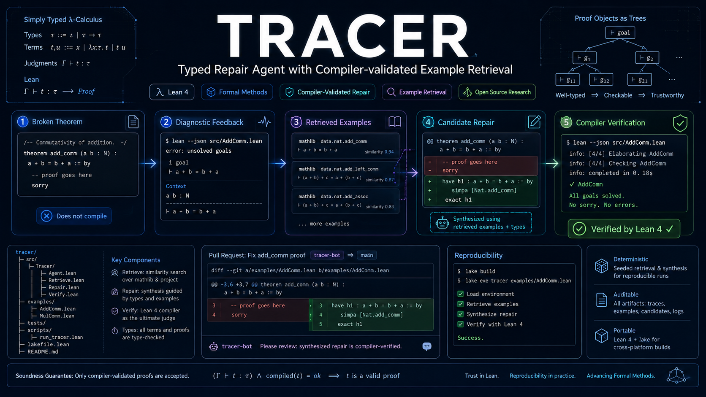
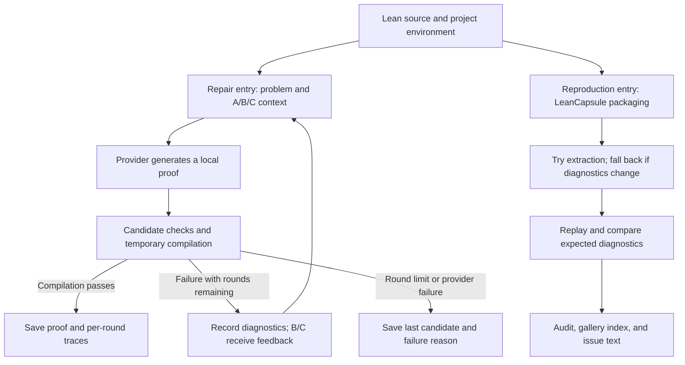

# TRACER

**English** | [简体中文](README.zh-CN.md)

### Typed Repair Agent with Compiler-validated Example Retrieval

**Feedback-driven Lean proof repair. Replayable failures. Evidence-backed experiments.**

[](https://github.com/runqi-allen-wang/TRACER-Typed-Repair-Agent-with-Compiler-validated-Example-Retrieval/actions/workflows/ci.yml)
[](lean-toolchain)
[](.github/workflows/ci.yml)

[Quick start](#quick-start) · [Design contributions](#design-contributions) · [Pilot results](#pilot-results) · [API guide](docs/API_GUIDE.md) · [Failure gallery](capsules/index.md) · [Contributing](CONTRIBUTING.md)



TRACER is a **research toolkit for Lean 4 proof repair, failure reproduction, and evaluation**. It connects language-model candidates, Lean compiler feedback, local example retrieval, and per-round experiment records. Its **LeanCapsule** component packages failures into shareable, replayable, and auditable artifacts.

The project offers two complementary workflows: reproduce an error with LeanCapsule, **without a model API**, or connect a real provider to run bounded proof repair and A/B/C experiments. Both share compilation and diagnostic infrastructure, but have separate entry points and acceptance criteria.

> **Research scope:** TRACER does not train or fine-tune models. It focuses on inference-time feedback, local repair, and reproducible experiment and failure artifacts, providing replaceable, inspectable infrastructure for method research.

Available artifacts:

- **24 public failure capsules**, spanning four error families and Std, Mathlib, and project-local dependencies.
- **A 12-core / 4-challenge feasibility experiment** whose 16 cases preserve normalized diagnostics and replay in clean temporary directories, including project-local multi-file cases.
- **18 frozen problems × 3 experimental conditions**, with a published real-provider pilot containing 56 per-round records and 54 successful proof files.
- **An end-to-end workflow** covering a single-problem CLI, local HTTP API, batch evaluation, manual review, report validation, and sanitized export.
- **A separate repair24 research suite** with retrieval-only, diagnostic-query and failure-context controls; multi-model results are pending. Jump to [research evaluation](#research-evaluation-beyond-the-smoke-test) and [related work](#related-work).

These artifact counts are not evidence of general theorem-proving ability or superior performance; experimental limitations are discussed below.

Both README versions provide a full overview and runnable examples. Most linked detailed guides are currently in Chinese.

## Why TRACER?

Repairing a Lean proof raises three distinct questions:

1. **Why did it fail?** An unresolved name, type mismatch, failed instance synthesis, or unfinished goal?
2. **Can someone else reproduce it?** An error screenshot or proof fragment rarely captures the toolchain, imports, and local context.
3. **Does an improvement actually help?** Success rates should be traceable to problems, model settings, candidates, compiler diagnostics, and final proofs—not just terminal output.

TRACER treats these questions separately and connects them through readable records. Developers get repair artifacts they can recompile; researchers get evidence for inspecting experimental settings and failures; collaborators get replayable error cases.

## Design contributions

These are verifiable engineering contributions and a combination of design choices, not claims to have invented compiler feedback, retrieval augmentation, or automated theorem proving.

| Design focus | Implementation | Value |
| --- | --- | --- |
| **Failures as first-class artifacts** | LeanCapsule stores Lean files, environment information, expected diagnostics, provenance, and replay entry points | Share, reproduce, and retain errors as regression cases without relying on the original terminal session |
| **Compiler-checked case extraction** | Recompile extracted theorems, fall back to the full file if diagnostics change, and attempt import removal within a budget | Check that a smaller case preserves the failure instead of equating shorter files with successful reproduction |
| **Controlled inference-time repair** | Local generation → candidate checks → compilation in the project environment → bounded feedback, for at most three rounds | Study feedback and examples without changing model weights or overwriting the original problem |
| **Traceable experimental evidence** | Record model settings, candidates, actual retrieved examples, usage, and diagnostics; save proofs; validate before formal reporting | Reduce the risk of mistaking mixed batches, cache reuse, or infrastructure errors for improved model capability |

Implementation: [repair loop](src/agent.py) · [capsule packaging](src/leancapsule/pack.py) · [import minimization](src/leancapsule/minimize.py) · [pilot validation](scripts/validate_pilot.py) · [release export](scripts/export_pilot.py).

## How it works



The two entry points work independently. The Agent does not automatically turn every failed attempt into a capsule. To add a failure to the gallery, explicitly run `pack` and supply provenance and review information.

**“Success” has two different meanings:**

- **Agent success:** a candidate passes Lean compilation and the project's incomplete-proof checks.
- **Capsule replay success:** the observed compilation status, diagnostic category, and normalized diagnostic text match expectations. For a case expected to fail compilation, reproducing that failure is a successful replay.

Thus, 24/24 gallery replays do not mean that a model solved 24 proofs, and must not be conflated with A/B/C repair success rates.

## Who is it for?

- **Lean users and maintainers:** attach errors with environment details and reproduction steps to issues.
- **Formal mathematics and AI4Math researchers:** reuse frozen problems, prompt templates, and per-round traces to compare inference-time feedback strategies.
- **Agent developers:** replace the generation backend through the provider interface and judge repairs by compilation rather than model self-reports.
- **Courses and small research teams:** start with API-free failure replay, then move to real-model experiments and manual review.

## Quick start

### 1. Prepare the environment

Install Python, Git, and the Lean toolchain manager first. Ensure `python`, `lean`, and `lake` are available in your terminal. The repository's [lean-toolchain](lean-toolchain) pins Lean 4.32.0; CI uses Python 3.11. Installing Python dependencies does not install Lean.

To clone the repository:

```bash
git clone https://github.com/runqi-allen-wang/TRACER-Typed-Repair-Agent-with-Compiler-validated-Example-Retrieval.git tracer
cd tracer
```

If you already have a checkout, enter its root directory. These single-line commands work in both PowerShell and Git Bash:

```text
python -m pip install -r requirements.txt
lake build
```

If PowerShell cannot locate `ELAN_HOME`, set the existing toolchain directory for the current terminal and retry:

```powershell
$env:ELAN_HOME = "$env:USERPROFILE\.elan"
```

### 2. Replay a failure without an API

```text
python -m leancapsule replay capsules/std/unknown-identifier
```

This case is expected to produce an unknown-identifier error. `ok: true` in the JSON output means **the expected error was reproduced**, not that the source compiled successfully.

You can also package a supplied failing input into a new capsule. This example writes to `results/` without overwriting public cases:

```text
python -m leancapsule pack --project . --file examples/capsule_failures/unknown_identifier.lean --lines 1:7 --out results/capsules/unknown-identifier
python -m leancapsule replay results/capsules/unknown-identifier
python -m leancapsule issue results/capsules/unknown-identifier --out results/capsules/unknown-identifier/issue.md
```

A newly generated capsule is a local reproduction artifact. Before publication, add classification, provenance, license information, and manual review. Successful `pack` execution does not imply a passed release audit. See the [LeanCapsule artifact format](docs/CAPSULE_FORMAT.md).

### 3. Check the repair workflow without an API

```text
python src/agent.py solve --file lean_project/Benchmarks/Evaluation18.lean --theorem Eval18.and_swap_eval --condition B --provider mock --mock-candidate "by intro h; exact And.intro h.right h.left"
```

The `mock` provider only tests patching, compilation, and saving. Its candidate is supplied by the user and **is not a model experiment result**. Targets may use `-- PROOF_START` / `-- PROOF_END` markers or a unique `sorry` placeholder inside the target theorem. Successful files go to `results/solutions/`; the original file remains unchanged.

## Connecting real models

The [model API guide](docs/API_GUIDE.md) covers DeepSeek V4 Pro/Flash, OpenAI GPT, environment variables, PowerShell / Git Bash, the local HTTP interface, and troubleshooting.

The built-in `openai_compatible` provider supports both **Chat Completions** and the **Responses API**. Responses mode is selected with `--wire-api responses`; reasoning effort and response storage are explicit controls. The model name, endpoint, and key must still belong to the same service.

### DeepSeek

```text
python src/agent.py solve --file lean_project/Benchmarks/Evaluation18.lean --theorem Eval18.and_swap_eval --condition B --provider openai_compatible --api-url "https://api.deepseek.com/chat/completions" --model deepseek-v4-pro --temperature 0 --max-tokens 12000 --api-key-prompt --max-rounds 3 --timeout 60
```

### OpenAI GPT

```text
python src/agent.py solve --file lean_project/Benchmarks/Evaluation18.lean --theorem Eval18.and_swap_eval --condition B --provider openai_compatible --api-url "https://api.openai.com/v1/chat/completions" --model gpt-4.1 --temperature 0 --max-tokens 4000 --api-key-prompt --max-rounds 3 --timeout 60
```

Key input is hidden; after reading it, the CLI displays only its length and last four characters. Never put a full key in scripts, a README, commit messages, or issues. Real API calls may incur charges.

For DeepSeek Flash, change the model to `deepseek-v4-flash`. GPT-4.1 is a compatibility example for the current request structure, not a recommendation of the latest model; do not assume GPT-5 variants accept identical parameters. The examples use different output budgets and are not an equal-budget comparison. DeepSeek ignores temperature in thinking mode; see the API guide for restrictions and official references.

Other interfaces:

- **Command provider:** use `--provider command --provider-command ...` to connect a custom generation program. Input/output conventions are in the API guide.
- **Local HTTP API:** run `python src/api_server.py --host 127.0.0.1 --port 8765` and send JSON configuration to `POST /solve`. This is not an authenticated public service; use it only in a trusted local environment.

### Diagnosing failures

- `provider_error` means the request did not produce a candidate for Lean compilation. Check the endpoint, model, key, quota, or network.
- Compiler diagnostics such as `diagnostic.category = syntax/type/goal` mean a candidate reached compilation; they do not by themselves indicate a broken API.
- `compile_ok: false` alone does not mean the API is broken; read `diagnostic` as well.
- Candidate normalization removes Markdown code fences before compilation, including fences in historical cached candidates.

Single-problem candidates, model usage, cache hits, and compiler diagnostics are recorded in `results/agent_runs.jsonl`. Successful proofs go to `results/solutions/`; the last candidate after persistent failure goes to `results/solutions/failures/`.

## Experimental design

The frozen evaluation set is [Evaluation18.lean](lean_project/Benchmarks/Evaluation18.lean); problem IDs, tags, and difficulty are in the [benchmark manifest](benchmarks/manifest.json). **18 distinct problems × 3 conditions = 54 task–condition pairs**, not 54 independent problems.

| Condition | Context visible to the model | Research question |
| --- | --- | --- |
| **A: Problem** | The theorem and target local code, without previous diagnostics or retrieved examples | What can baseline generation achieve with the same round budget? |
| **B: Problem + feedback** | A, plus bounded compiler diagnostics from the previous round | Can feedback help repair the preceding candidate? |
| **C: Problem + feedback + retrieval** | B, plus the text of the top three local examples | Are related examples worth their extra token cost beyond feedback alone? |

Model settings, output budget, compiler, timeout, problem order, and the three-round limit are held constant across conditions; only prompt context changes. A can generate multiple times but does not read previous diagnostics. B/C have no previous-round feedback on their first attempt.

Evaluation does not use a runtime answer table. Retrieval checks for examples with declarations identical to evaluation problems; similar but non-identical propositions still require manual review. **Text deduplication does not eliminate every form of semantic leakage.** Here, `pass@3` means the proportion of tasks with at least one success within three rounds, not an unbiased pass@k estimate from independent samples. See the [experimental protocol](docs/methodology.md).

### AxProverBase Part 1 + Part 2 paired experiment and B confound arm

The separate FATE-M experiment compares Part 1's AxProverBase `ExperienceProcessor` baseline with Part 2's `MemorylessProcessor` plus deterministic `CapsuleFeedback`. Both conditions reuse the same first-round candidate for each of 25 problems and freeze `gpt-5.6-sol`, the AI4Math `yxai` Responses endpoint, budgets, and candidate policy. Both solved 25/25; total rounds decreased from 39 to 36, compilation errors from 14 to 11, LLM calls from 79 to 36, and tokens from 656,657 to 274,742. In that Memoryless Part 2 condition, Capsule processing itself made zero LLM and compiler calls. See the [Part 2 design](docs/part2_capsule_feedback.md) and [reviewed result handoff](results/handoff/part12-live-20260828-corrected/README.md).

Because the original comparison changes both memory and feedback at once, a separate
`capsule_experience` confound arm was run with Part 1's `ExperienceProcessor` and the
same deterministic `CapsuleFeedback`. It solved 20/25 (80.0%), with 47 total rounds,
69 LLM requests (27 Memory requests), 27 compilation errors, and 659,791 total tokens;
4 of the 9 shared first-round failures were repaired. This is a single descriptive
batch, not a replacement for the original two-condition result. It is also distinct
from the Evaluation18 condition named B above and is not a fourth ABCD agent condition.
See the [B arm design and result](docs/part2_capsule_feedback_confound_arm.md) and the
[B arm handoff report](results/handoff/part2-experience-capsule-20260829/REPORT.md).

## Pilot results

These results come from the published pilot `pilot-20260826T122354Z-d628742d`, not a new experiment run for this README update. Configuration: `deepseek-v4-pro`, requested temperature 0, maximum output 12,000 tokens, and at most three rounds.

| Condition | Tasks | pass@1 | pass@3 | Mean rounds | Mean total tokens / task |
| --- | ---: | ---: | ---: | ---: | ---: |
| A: Problem | 18 | 18/18 (100.0%) | 18/18 (100.0%) | 1.000 | 1,750.4 |
| B: Problem + feedback | 18 | 16/18 (88.9%) | 18/18 (100.0%) | 1.111 | 1,841.9 |
| C: Problem + feedback + retrieval | 18 | 18/18 (100.0%) | 18/18 (100.0%) | 1.000 | 2,906.1 |

Mean total tokens are calculated by summing provider usage over every round of each task, then averaging over the condition's 18 tasks—not by counting only the final successful round.

The release includes **56 per-round records, 54 successful proof files, and zero cache hits**. Token prices were not configured, so monetary cost is `unknown`, not zero.

**How to interpret the results:**

- They provide operational evidence for the real-provider → compilation → proof saving → review and export workflow.
- A already reaches 18/18 on the first attempt, creating a clear ceiling effect. This batch **does not demonstrate a final success-rate gain from B or C**. C also uses more tokens, so these results do not establish greater efficiency.
- Eighteen problems, one model, and one batch cannot establish general theorem-proving capability, statistically significant superiority, or state-of-the-art performance. Even 18/18 corresponds to an approximately 82.4%–100.0% Wilson 95% interval.
- Recompiling final proofs does not guarantee that another call to the same model will produce identical text. Server defaults and generation variability must be disclosed.

**Inspect the evidence:** [full report](published/pilot-20260826T122354Z-d628742d/REPORT.md) · [sanitized per-round traces](published/pilot-20260826T122354Z-d628742d/real_pilot_runs.sanitized.jsonl) · [successful proofs](published/pilot-20260826T122354Z-d628742d/solutions) · [manual review](published/pilot-20260826T122354Z-d628742d/manual_review.csv) · [handoff manifest](published/pilot-20260826T122354Z-d628742d/handoff.json).

### Run your own formal experiment

See the [real-pilot generation, review, and export guide](docs/REAL_PILOT_GUIDE.md). Run and export a separate batch for each model; do not mix logs from different models, budgets, or runs.

<details>
<summary>Expand: full pilot and formal release commands (PowerShell)</summary>

Start with the frozen set. This calls a real model and may incur charges. `--fresh` moves old logs, proofs, review sheets, and reports into recoverable `results/archive/` storage and clears the persistent request cache by default:

```powershell
python src/evaluate.py --provider openai_compatible --api-url "https://api.deepseek.com/chat/completions" --model deepseek-v4-pro --temperature 0 --max-tokens 12000 --api-key-prompt --conditions A,B,C --max-rounds 3 --timeout 60 --fresh
```

Complete per-task manual review in this batch's `results/manual_review.csv`, then run:

```powershell
python scripts/validate_pilot.py --runs results/real_pilot_runs.jsonl --require-manual-review
if ($LASTEXITCODE -ne 0) { throw "Validation failed; release stopped" }
python src/report.py
if ($LASTEXITCODE -ne 0) { throw "Report generation failed; export stopped" }
python scripts/export_pilot.py --out published/deepseek-v4-pro-12000-run01
```

The export directory must not already exist. Validation checks task coverage, consecutive rounds, configuration consistency, cache hits, and infrastructure errors. Formal reporting also requires manual review and proof artifacts. Do not fill review rows with PASS merely to satisfy validation.

With explicit `--reuse-cache`, results are not a strict fresh experiment: retain the warnings and treat them as a draft. Publish sanitized exports, not raw logs, SQLite databases, or historical archives.

</details>

## LeanCapsule failure gallery

LeanCapsule provides a **failure-reproduction protocol centered on diagnostic consistency**. It retains human-readable error text and a readable diagnostic key with local paths, line/column positions, and unstable identifiers removed. Matching normalized text is an operational reproduction criterion, not a claim of mathematical or program equivalence between files.

The current [gallery](capsules/index.md) contains 24 cases:

| Error family | Cases | Typical issues |
| --- | ---: | --- |
| Name / import | 7 | Unknown identifiers, namespaces, or missing imports |
| Type / application | 5 | Type mismatches, function application, or implicit arguments |
| Elaboration / instance | 5 | Instance synthesis, metavariables, or coercions |
| Goal / scope | 7 | Unsolved goals, local context, or scope |

Sources: **Std 14 · Mathlib 4 · project-local 6**. Indexes are available as [JSON](capsules/index.json), [CSV](capsules/index.csv), and [Markdown](capsules/index.md). The [review ledger](capsules/MANUAL_REVIEW.csv) records provenance, semantic checks, and sensitive-content review.

The separate [12-core / 4-challenge feasibility experiment](docs/CAPSULE_FEASIBILITY.md) checks a balanced four-taxonomy × three-context core matrix and four harder cases. All 16 cases preserved the full ordered normalized diagnostics and replayed after copying into fresh temporary directories. Project-local imports are copied as a bounded source closure and rebuilt from source before replay; compiled `.olean`/`.ilean` artifacts are not packaged.

Packaging with `--theorem` attempts a standalone file containing imports, namespaces, and the target theorem. If compilation status or normalized diagnostics change, it falls back to the full file. Validated standalone files then undergo import minimization within a compilation budget; disable this with `--no-minimize-imports`. The `--lines` range records the target and is not a general semantic slicing feature.

### Mathlib environment

Mathlib cases use the separate [mathlib_project](mathlib_project) dependency project. Prepare its pinned dependencies before the first replay:

```powershell
./scripts/setup_mathlib.ps1
```

On Linux/macOS:

```bash
bash scripts/setup_mathlib.sh
```

Dependencies and precompiled caches are not committed. The Bash setup script retries dependency synchronization and cache downloads up to three times, waiting 5 and 10 seconds between attempts. Before retrying synchronization, it moves incomplete Git package clones with no valid HEAD into `.lake/retry-backups/`; valid repositories, linked packages, and non-Git local dependencies are left intact. Failed attempts retain their error output, and exhausting retries still fails CI. The CI setup step has a 30-minute limit; no certificate checks are disabled.

For Bash setup, `TRACER_SETUP_ATTEMPTS` (1–5) and `TRACER_SETUP_RETRY_DELAY` (0–30 initial seconds) control retries. `MATHLIB_CACHE_DIR` defaults to the project's `.lake/mathlib-cache`, unless explicitly set. These retry settings apply to the Bash entry point, not the PowerShell script. On Windows, use `$env:ELAN_HOME = "$env:USERPROFILE\.elan"`, including the separator before `.elan`. Configure `HTTP_PROXY` / `HTTPS_PROXY` only if you need a local proxy.

Without network access or prepared Mathlib dependencies, start with Std and project-local cases. This does not validate the Mathlib cases. The default replay timeout is 180 seconds.

## Tests and quality checks

These checks do not call paid model APIs, but end-to-end tests require a real Lean toolchain:

```text
lake build
python scripts/run_capsule_feasibility.py
python scripts/run_ci_tests.py
python -m leancapsule audit capsules
```

After preparing Mathlib dependencies, replay the full gallery:

```text
python -m leancapsule verify capsules
```

To regenerate the index:

```text
python -m leancapsule gallery capsules --out capsules/index.json
```

The [CI workflow](.github/workflows/ci.yml) installs the toolchain, builds Lean, runs Python checks and tests, audits releases, prepares Mathlib dependencies, and replays the full gallery. Its badge links to actual Actions runs instead of displaying a fixed “all passed” claim.

Keep these checks distinct:

- `audit` checks layout, schema, provenance and licenses, sensitive information, incomplete proofs, and the review ledger. It **does not replace compilation replay**.
- `verify` checks whether expected failures reproduce. It **does not replace real-model evaluation**.
- `validate_pilot.py` and review records check experimental deliverables. They **do not replace substantive inspection of mathematical assumptions and example leakage**.

## Safety and scope

- **Not an operating-system sandbox.** Temporary HOME/TMP/APPDATA directories, minimal environment variables, and candidate policies are defense layers. Run untrusted projects or Lean code in a container, VM, or isolated low-privilege environment.
- **Local repair only.** The Agent must not rewrite imports or theorem headers. Candidates containing `sorry`, `admit`, `sorryAx`, unfinished-proof warnings, unsafe declarations, or certain explicit native-execution constructs are rejected. D01 verifies that an `unsafe inductive` construction of `False` is rejected before Agent, AxProverBase, Capsule pack, replay, or audit can compile it; this is a security regression, not a fourth A/B/C condition and not the research matrix’s retrieval-only arm D. Text rules cannot be assumed to detect every Lean metaprogramming construct.
- **Separate credentials from releases.** The provider restricts cross-origin redirects and sanitizes errors; keys are not experiment-record fields. Still inspect exports and send keys only to trusted providers.
- **Readable comparisons and caching.** Diagnostic comparisons and request caching use normalized readable text, without digest or fingerprint computation. Cache reuse is for local debugging, not independent real sampling.
- **Extraction is not global minimization.** Full-file fallback and explicit local-file manifests are not arbitrary multi-file program slicing. Diagnostic consistency does not guarantee preservation of every contextual meaning.
- **Implemented infrastructure, unproven generalization.** The toolkit and published pilot do not replace larger, harder, multi-model, repeated experiments. The current retriever is not a learned premise-selection model.

## Documentation and repository map

| Goal | Start here |
| --- | --- |
| Configure DeepSeek, GPT, or a custom provider | [API guide](docs/API_GUIDE.md) |
| Run, review, and export real experiments | [Pilot guide](docs/REAL_PILOT_GUIDE.md) |
| Understand condition controls and validity constraints | [Methodology](docs/methodology.md) |
| Look up per-round record fields | [JSONL format](docs/jsonl_schema.md) |
| Create publicly shareable failure artifacts | [Artifact format](docs/CAPSULE_FORMAT.md) and [case contribution guide](docs/CONTRIBUTING_CAPSULES.md) |
| Run or inspect the AxProverBase Part 1 + Part 2 experiment | [Part 1 guide](baseline/README.md), [Part 2 design](docs/part2_capsule_feedback.md), [Part 3 handoff checklist](docs/part3_experiment_handoff.md), and [result handoff](results/handoff/part12-live-20260828-corrected/README.md) |
| Inspect the Experience + CapsuleFeedback confound arm | [B arm design and result](docs/part2_capsule_feedback_confound_arm.md) and [B arm handoff](results/handoff/part2-experience-capsule-20260829/REPORT.md) |
| Inspect the D01 pre-compilation security gate | [Type D security regression](docs/security_type_d.md) |
| Inspect the 12-core / 4-challenge clean-replay experiment | [Capsule feasibility report](docs/CAPSULE_FEASIBILITY.md) |
| Inspect published experiments and proofs | [Pilot release](published/pilot-20260826T122354Z-d628742d) |
| Check current status and past changes | [PROGRESS](PROGRESS.md) and [CHANGELOG](CHANGELOG.md) |

```text
src/agent.py           Proof repair loop and single-problem CLI
src/provider.py        Model interface and candidate parsing
src/compiler.py        Lean compilation and local proof patching
src/retriever.py       Local example retrieval and overlap checks
src/leancapsule/       Packaging, extraction, replay, audit, and issues
capsule_schema/        Capsule manifest schema
capsules/              Public failures, indexes, and review ledger
examples/              Local retrieval examples and failing inputs
benchmarks/            Frozen problem metadata
lean_project/          Lean problems and local-dependency cases
mathlib_project/       Separate Mathlib dependency project
prompts/               A/B/C prompt templates
scripts/               Dependency setup, tests, pilot validation, and export
baseline/              AxProverBase Part 1 and paired Part 2/B experiment runners
configs/               Frozen AxProverBase model and memory configurations
tests/                 Automated tests
results/               Local run data and reports
published/             Reviewed, sanitized experimental releases
docs/                  Usage guides and research methodology
```

## Research evaluation beyond the smoke test

**Preflight observation (2026-08-28, legacy strict-warning protocol):** DeepSeek Flash passed 20/24 and Pro 19/24 within three attempts in the B-only, single-repeat run; both passed 18/24 on the first attempt. All 39 saved successes were independently recompiled. There were 69 requests, no infrastructure failures, and an estimated total cost of $1.2260 under the recorded prices—not a bill. These local, not-yet-published results do not establish a model ranking or feedback/retrieval gains.

The audit found 21 output-limit truncations with no final proof, three otherwise valid candidates rejected only by linters, and confusion between completing a proof tail and replacing the whole proof. New runs use **`tracer-proof-v2`**: an explicit whole-proof contract shared by all arms, frozen prompt templates, separate truncation outcomes, and separate kernel/warning-free fields. Incomplete proofs remain rejected. Historical scores are unchanged, and protocol versions must not be mixed. See [the audit, evidence location, and revised protocol](docs/RESEARCH_PROTOCOL.md#4-轨迹与报告); v2 has only offline validation so far.

The original 18 problems and published A/B/C pilot remain an **engineering smoke test**, not evidence of broad superiority. The new [repair24-v1](benchmarks/repair24/manifest.json) contains 24 authored repair tasks across recursive lists, quantifiers, functions, options, and recursive arithmetic. Each has a concrete broken proof and a separately tested reference repair. Structural difficulty is a design objective; the limited preflight above does not establish generalization.

| Arm | Compiler feedback | Retrieved examples | Query |
| --- | --- | --- | --- |
| A | No | No | — |
| B | Yes | No | — |
| C | Yes | Yes | Fixed |
| D | No | Yes | Fixed |
| C_dynamic | Yes | Yes | Updated from errors, types and goals |
| C_failure | Yes | Yes, plus failure-capsule context | Same strategy as C_dynamic |

A/D still compile to decide whether to stop; diagnostics are not sent back to the generator. The two additional arms separate query adaptation from failure reuse, rather than silently changing the old C condition. Model weights are never updated.

The [research runner](src/research.py) freezes readable input snapshots, randomizes task order, disables request-cache reuse, records full prompts and usage, and independently recompiles saved proofs. It supports multiple models and repeats; incomplete or mixed traces are rejected by report validation. Unknown costs remain unknown, and manual review is separate from automatic checks.

~~~powershell
python src/research.py check-benchmark
python src/research.py plan --config experiments/research.example.json
~~~

The example plan has **864 tasks / at most 2,592 logical generations**: 24 problems × 2 models × 3 repeats × 6 arms. These commands do not call a model API. Replace the example model names and review the budget before explicitly running a paid experiment. See the [research protocol and commands](docs/RESEARCH_PROTOCOL.md).

Ready-to-review DeepSeek configurations are available for [Flash/Pro preflight](experiments/research.deepseek.preflight.json) (48 B-arm tasks) and the [full matrix](experiments/research.deepseek.json). The paid CLI requires explicit call and conservative cost-reservation limits, uses hidden in-memory key entry, and disables automatic HTTP retries. These limits are not a vendor-enforced billing cap. Thinking mode is explicitly fixed; DeepSeek ignores temperature in this mode. No new paid results are claimed until the actual traces exist.

The [human-study runner](src/human_study.py) offers 8 compiler-checked synthetic context/reduced pairs, complementary participant assignments, source display only after timing starts, abandonment/timeout records, and separate review records. The existing gallery's 23 mapped source pairs are identical, so they cannot establish source-reduction benefits through reading-time comparisons. The new materials are a **synthetic feasibility study**, not a study of naturally occurring bugs. Timings must come from real people, not AI substitutes; do not read the materials or reviewer answers before participating.

[Capsule metrics](src/capsule_metrics.py) separately measure replay agreement, source-size reduction and human diagnosis times. Cross-environment claims require actual independent environment records; changing a label is not a new environment. Human timings require participants and reviewed diagnoses. The experimental machinery is implemented; **multi-model gains, cross-environment benefits and human-time savings are not yet established**.

Local reproducibility check (2026-08-28): **Windows 11 and Ubuntu WSL2 each matched 48/48 replays** of the same 24 cases under native Lean 4.32.0. This is cross-OS diagnostic reproduction on one physical machine—not independent hardware validation, a cold-start benchmark, or evidence of speedup. Both environments validated 23 source pairs; their median source reduction remains zero. Local trace locations and the retained incomplete precheck are recorded in [PROGRESS.md](PROGRESS.md).

## Related work

TRACER builds on established directions rather than claiming to invent compiler feedback or retrieval:

- [MathForm](https://arxiv.org/abs/2608.14221): retrieval and verification-guided statement autoformalization; our target is repairing proofs of fixed formal statements.
- [APOLLO](https://arxiv.org/abs/2505.05758) and [Baldur](https://arxiv.org/abs/2303.04910): closely related compiler-guided/whole-proof repair approaches. Their work makes clear that feedback-based repair itself is not our novelty.
- [LeanDojo / ReProver](https://arxiv.org/abs/2306.15626), [LeanAgent](https://arxiv.org/abs/2410.06209) and [Lean Copilot](https://arxiv.org/abs/2404.12534): relevant work on premise retrieval, evolving knowledge and interactive proof assistance. Our current retriever is a lightweight heuristic, not a replacement for these trained systems.
- [miniF2F](https://arxiv.org/abs/2109.00110): a broader formal-mathematics benchmark; our authored repair set is not directly comparable.
- [Delta Debugging](https://pm.st.cs.uni-sb.de/papers/tse2002/?lang=en): foundational work on failure-preserving reduction. Our bounded import removal does not establish globally minimal programs.

See the [related-work comparison](docs/RELATED_WORK.md) for boundaries and testable research questions. Our emphasis is auditable repair experiments and reusable failure artifacts; their practical benefit must be demonstrated rather than inferred from feature counts.

## Contributing and future research

Contributions of reproducible failures, tests, diagnostic improvements, and model integrations are welcome. Read [CONTRIBUTING](CONTRIBUTING.md) first, and include provenance, licensing, toolchain information, expected results, and reproduction steps for new cases.

Future research directions include harder and broader benchmarks, cross-model and repeated-run comparisons, retrieval cost–benefit analysis, adversarial candidate tests, and stronger execution isolation. These are directions to investigate, not completed capabilities or performance promises.

For genuinely shared work, include `Co-authored-by: Name <email>` in the commit message. An @mention in a PR description does not replace commit co-authorship.

## Citation and license

For research or teaching use, cite [CITATION.cff](CITATION.cff) and identify the actual version and experiment batch. This is a software citation, not a claim of an associated peer-reviewed paper or DOI.

This project is licensed under the [MIT License](LICENSE). Public cases also record their respective provenance and licenses in their capsule metadata.

### Acknowledgments

We gratefully acknowledge [SJTU AI4Math Summer School 2026](https://sjtu-ai4math.github.io/summer-school/2026/) for providing a platform for learning and exchanging ideas at the intersection of artificial intelligence and mathematics. We thank the organizers, instructors, and participants for fostering an open and collaborative research environment.
