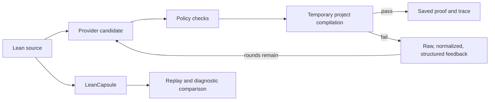

# TRACER

**English** | [简体中文](README.zh-CN.md)

### Typed Repair Agent with Compiler-validated Example Retrieval

**Feedback-driven Lean proof repair, replayable failures, and evidence-backed evaluation.**

[](https://github.com/runqi-allen-wang/TRACER-Typed-Repair-Agent-with-Compiler-validated-Example-Retrieval/actions/workflows/ci.yml)
[](lean-toolchain)
[](LICENSE)

> [!IMPORTANT]
> **[Open the interactive TRACER demo](https://runqi-allen-wang.github.io/TRACER-Typed-Repair-Agent-with-Compiler-validated-Example-Retrieval/)** — explore 24 verified Lean repairs across five proof domains and four diagnostic families. Filter cases, inspect compiler feedback, and replay each frozen failure beside an independently recompiled solution. No API key or installation is required.


[Interactive demo](#try-tracer-in-60-seconds) · [Quick start](#quick-start) · [Latest results](#latest-published-results) · [Evidence status](PROGRESS.md) · [API guide](docs/API_GUIDE.md) · [Failure gallery](capsules/index.md) · [Historical archive](historical/README.md) · [Contributing](CONTRIBUTING.md)


TRACER is a research toolkit for **Lean 4 proof repair, compiler-feedback experiments, and reproducible failure artifacts**. It compiles every candidate in the target project, records per-round diagnostics and retrieved examples, and saves successful proofs for independent rechecking. LeanCapsule turns failures into portable, auditable regression cases.

> TRACER does not train or fine-tune models. It studies inference-time repair and the evidence needed to distinguish a compiled proof, a reproduced failure, and a supported research claim.

## Try TRACER in 60 seconds

**[Open the interactive web demo](https://runqi-allen-wang.github.io/TRACER-Typed-Repair-Agent-with-Compiler-validated-Example-Retrieval/)** · [Inspect its public source](demo/) · [Open the underlying audited release](published/research-six-arm-313f437f)

The demo is a dynamic browser interface backed by static public evidence. It contains all 24 `repair24` failure/solution pairs, with filters for recursive lists, quantifiers, functions, options, and recursive naturals, plus type mismatch, unknown identifier, unsolved-goal, and tactic/elaboration diagnostics. “Dynamic” means interactive JavaScript—not a live model call: it needs no API key, uploads no code, and makes no network request. After cloning, launch the same page locally with:

```text
python demo/serve.py
```

The page also explains exactly where TRACER intervenes: isolated proof-region patching, raw/normalized/structured compiler feedback, error-adaptive retrieval, bounded retries, and kernel validation with saved evidence. Across the published 864 task instances, **735/864 (85.1%)** passed on the first candidate and **811/864 (93.9%)** passed within at most three rounds: 76 additional task instances, or **+8.8 percentage points**, were recovered by the bounded loop. This first-to-final conversion is descriptive—not a causal estimate of TRACER's effect. The local quick start below invokes the real Lean compiler.

## Experiment and policy namespaces

| Namespace | Meaning | Status |
| --- | --- | --- |
| **R-A / R-B / R-C / R-D / R-E / R-F** | repair24 research arms for feedback and retrieval | The preregistered 864-task matrix is complete and released |
| **SP-1 through SP-12** | Pre-compilation security policies with benign controls | Offline suite and one native Linux Docker run published; Windows Docker Desktop remains pending |

Research-arm storage values remain `A/B/C/D/C_dynamic/C_failure` for compatibility. Public discussion uses R-A through R-F; SP identifiers are policies, not extra experimental arms. See the [research protocol](docs/RESEARCH_PROTOCOL.md) and [security policy](docs/security_policy.md).

## Current state

- **Six-arm repair24 study:** the preregistered 864-task matrix is complete. Its release contains 1,066 sanitized attempts, 811 successful proofs, an AI-assisted review ledger, and a reproducible audit contract.
- **TRACER-REAL v2 and the ACL 2027 causal protocol:** Six projects fully screened: **1,576 candidates, 256 admitted, and 1,320 rejected**, with no v2 provider calls. The frozen test split contains **254 repairs from five independent projects** and six error categories; the disclosed provider-blind amendment changed the project-share gate from 35% to 40%. A nested preregistration assigns full eight-arm runs to DeepSeek and GLM and the three confirmatory arms to MiniMax; all three use first-party API origins and the exact same-candidate intervention. The offline benchmark, retrieval-overlap, configuration, and runtime-preregistration gates pass; real provider preflights and paid runs have not yet occurred. See the [ACL execution protocol](docs/ACL2027_EXPERIMENT_PROTOCOL.md), [original enrollment contract](benchmarks/real_repairs/tracer_real_v2.enrollment.json), [v2 protocol and amendment](docs/TRACER_REAL_V2.md), and [final manifest](benchmarks/real_repairs/tracer_real_v2/manifest.json).
- **LeanCapsule:** 24 reviewed cases cover Std, Mathlib, and project-local environments; a separate 12-core / 4-challenge suite checks clean-directory replay.
- **Feedback and security:** the three-layer diagnostic protocol, [feedback-adoption audit](docs/FEEDBACK_ADOPTION_V1.md), and SP-1–SP-12 gates are implemented. A GitHub-hosted Ubuntu Docker Engine run observed all 14 frozen low-privilege controls; Windows Docker Desktop and unknown-attack evaluation remain pending.

## Quick start

Requirements: Python 3.11+, Git, and Lean through `elan`. The repository pins Lean in [lean-toolchain](lean-toolchain).

```text
git clone https://github.com/runqi-allen-wang/TRACER-Typed-Repair-Agent-with-Compiler-validated-Example-Retrieval.git tracer
cd tracer
python -m pip install -r requirements.txt
lake build
```

Replay a failure without calling a model API:

```text
python -m leancapsule replay capsules/std/unknown-identifier
```

For a failure capsule, `ok: true` means the expected failure was reproduced; it does not mean the Lean file compiled successfully.

Check the repair pipeline with a supplied mock candidate:

```text
python src/agent.py solve --file lean_project/Benchmarks/Evaluation18.lean --theorem Eval18.and_swap_eval --condition B --provider mock --mock-candidate "by intro h; exact And.intro h.right h.left"
```

Run one real DeepSeek request. The secret prompt does not echo or store the full key; it displays **only its length and last four characters** after reading it.

```text
python src/agent.py solve --file lean_project/Benchmarks/Evaluation18.lean --theorem Eval18.and_swap_eval --condition B --provider openai_compatible --api-url "https://api.deepseek.com/chat/completions" --model deepseek-v4-pro --temperature 0 --max-tokens 12000 --api-key-prompt --max-rounds 3 --timeout 60
```

Real requests may incur charges. Never place a key in a command, script, commit, issue, or result file. Responses API, GPT examples, custom providers, the local HTTP endpoint, and troubleshooting are in the [API guide](docs/API_GUIDE.md).

Interpret failures carefully: `provider_error` means no usable candidate was returned. A compiler category means a candidate reached Lean. `compile_ok: false` alone does not mean the API is broken; inspect `diagnostic` before retrying.

## How it works



Agent success means a candidate passed Lean and incomplete-proof checks. Capsule success means the expected compile status and diagnostics were reproduced. These are different outcomes.

## Latest published results

The latest release freezes 24 repair24 problems × two DeepSeek-family model configurations × three repeats × six research arms = **864 task instances**, with at most three rounds per task.


> “Before/after” in this figure means the first candidate versus the outcome after at most three repair rounds on the same task. R-A is the no-feedback/no-retrieval baseline. The chart is descriptive and must not be read as a causal effect of TRACER.

| Model configuration | Arm | Information supplied after a failure | pass@1 | Success within three rounds |
| --- | --- | --- | ---: | ---: |
| DeepSeek Flash v4.1 | R-A | none | 64/72 (88.9%) | 69/72 (95.8%) |
| DeepSeek Flash v4.1 | R-B | compiler feedback | 64/72 (88.9%) | 69/72 (95.8%) |
| DeepSeek Flash v4.1 | R-C | feedback + fixed retrieval | 65/72 (90.3%) | 69/72 (95.8%) |
| DeepSeek Flash v4.1 | R-D | fixed retrieval only | 61/72 (84.7%) | 68/72 (94.4%) |
| DeepSeek Flash v4.1 | R-E | feedback + diagnostic-adaptive retrieval | 66/72 (91.7%) | 70/72 (97.2%) |
| DeepSeek Flash v4.1 | R-F | R-E + failure-capsule context | 64/72 (88.9%) | 70/72 (97.2%) |
| DeepSeek Pro 0813 | R-A | none | 61/72 (84.7%) | 67/72 (93.1%) |
| DeepSeek Pro 0813 | R-B | compiler feedback | 56/72 (77.8%) | 65/72 (90.3%) |
| DeepSeek Pro 0813 | R-C | feedback + fixed retrieval | 60/72 (83.3%) | 67/72 (93.1%) |
| DeepSeek Pro 0813 | R-D | fixed retrieval only | 56/72 (77.8%) | 65/72 (90.3%) |
| DeepSeek Pro 0813 | R-E | feedback + diagnostic-adaptive retrieval | 61/72 (84.7%) | 67/72 (93.1%) |
| DeepSeek Pro 0813 | R-F | R-E + failure-capsule context | 57/72 (79.2%) | 65/72 (90.3%) |

Evidence: [audited six-arm release](published/research-six-arm-313f437f). It contains 864 task summaries, 1,066 sanitized attempts, 811 independently recompiled proofs, and 864 review rows; all 811 successful proofs passed AI-assisted checks. Five transport retries were reported at runtime, while release-time inventory found six archived attempt directories containing ten failed-round records; one additional call reservation has no round record. The release preserves these counts instead of reconciling them silently.

The preregistered primary comparison, R-B minus R-A, was **0.0 percentage points for Flash and −2.8 points for Pro** on success within three rounds. R-E/R-F reached the highest observed Flash value, but not on Pro. These are descriptive, model-family results over 24 unique problems; repeats and arms are paired observations, not independent new problems. The batch records 5,116,954 tokens and a configuration-based estimate of about US$13.39, not a provider invoice. No causal superiority, statistical significance, cross-provider generalization, or SOTA claim is made.

## Evidence and boundaries

| Area | What is supported now | Important boundary |
| --- | --- | --- |
| Six-arm repair24 study | Audited 864-task release; 811 proofs independently recompiled | AI-assisted review; 24 unique problems and one provider family |
| TRACER-REAL v2 / ACL 2027 | 254 test repairs across five independent projects; nested three-family protocol and exact runtime preregistrations pass offline audit | Provider preflight and paid runs are still pending; no v2 causal or cross-model result exists yet |
| LeanCapsule | 24/24 reviewed gallery replays; 16/16 feasibility replays | Reproducing an expected failure is not proof repair |
| Security | [SP v2 policy release](published/security-study-tracer-sp-v2): 0/12 dangerous false accepts and 0/8 benign false rejects; [Linux isolation evidence](published/security-isolation-tracer-sp-v1): 14/14 frozen controls observed | One Linux run is not complete dual-platform sandbox evidence or a zero-risk guarantee; Windows Docker Desktop remains pending |

The canonical evidence register is [PROGRESS.md](PROGRESS.md). Superseded releases, FATE-M handoffs, and the Evaluation18 smoke pilot are preserved—without deletion—in the [historical archive](historical/README.md); chronological changes remain in [CHANGELOG.md](CHANGELOG.md).

## Validation

The core checks do not call a paid model API:

```text
lake build
python -m unittest discover -s tests -v
python scripts/audit_security_isolation_release.py published/security-isolation-tracer-sp-v1
python -m leancapsule audit capsules
python -m leancapsule verify capsules
```

`audit` validates artifact structure and release policy; `verify` replays expected behavior. Neither substitutes for a model experiment or mathematical review.

## Key documentation

| Topic | Document |
| --- | --- |
| Provider/API setup | [API guide](docs/API_GUIDE.md) |
| Compiler Feedback v1 | [diagnostic protocol](docs/COMPILER_FEEDBACK_V1.md) · [feedback adoption](docs/FEEDBACK_ADOPTION_V1.md) |
| Causal controls and R-A–R-F | [causal feedback](docs/CAUSAL_FEEDBACK_V1.md) · [research protocol](docs/RESEARCH_PROTOCOL.md) |
| Real historical repairs | [TRACER-REAL builder](benchmarks/real_repairs/README.md) · [v2 enrollment](docs/TRACER_REAL_V2.md) |
| ACL 2027 experiment | [causal experiment execution protocol](docs/ACL2027_EXPERIMENT_PROTOCOL.md) |
| Failure artifacts | [Capsule format](docs/CAPSULE_FORMAT.md) · [gallery](capsules/index.md) |
| Security | [SP policies](docs/security_policy.md) · [isolation protocol](docs/SP_ISOLATION_V1.md) |
| Research context | [related work](docs/RELATED_WORK.md) |
| Superseded studies | [historical archive index](historical/README.md) |

## Next evidence priorities

1. Run the synthetic three-provider preflight without exposing TRACER-REAL tasks; do not substitute a failed model after observing benchmark outputs.
2. Run the frozen nested matrix only after all preflights pass: DeepSeek and GLM supply eight-arm results, while MiniMax supplies the three confirmatory arms.
3. Publish complete trajectories, independently recompiled proofs, review mode, infrastructure failures, and the 35%→40% amendment alongside any result.
4. Add the still-missing Windows Docker Desktop report to the SP isolation protocol; keep the published native Linux run as single-platform evidence.

These are plans, not completed results.

## Citation, license, and acknowledgments

For research or teaching use, cite [CITATION.cff](CITATION.cff) and identify the exact repository version and experiment batch. TRACER is released under the [MIT License](LICENSE); individual capsules retain their recorded source licenses.

Thanks to [SJTU AI4Math Summer School 2026](https://sjtu-ai4math.github.io/summer-school/2026/) for the learning and collaboration environment, and to [subfish-zhou](https://github.com/subfish-zhou) and [Fulcrum-Nebula](https://github.com/Fulcrum-Nebula) for feedback that sharpened the compiler-feedback and SP research directions.
