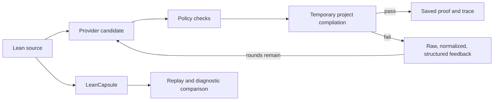

# TRACER

**English** | [简体中文](README.zh-CN.md)

### Typed Repair Agent with Compiler-validated Example Retrieval

**Feedback-driven Lean proof repair, replayable failures, and evidence-backed evaluation.**

[](https://github.com/runqi-allen-wang/TRACER-Typed-Repair-Agent-with-Compiler-validated-Example-Retrieval/actions/workflows/ci.yml)
[](lean-toolchain)
[](LICENSE)

[Quick start](#quick-start) · [Latest results](#latest-published-results) · [Evidence status](PROGRESS.md) · [API guide](docs/API_GUIDE.md) · [Failure gallery](capsules/index.md) · [Contributing](CONTRIBUTING.md)


TRACER is a research toolkit for **Lean 4 proof repair, compiler-feedback experiments, and reproducible failure artifacts**. It compiles every candidate in the target project, records per-round diagnostics and retrieved examples, and saves successful proofs for independent rechecking. LeanCapsule turns failures into portable, auditable regression cases.

> TRACER does not train or fine-tune models. It studies inference-time repair and the evidence needed to distinguish a compiled proof, a reproduced failure, and a supported research claim.

## Experiment and policy namespaces

| Namespace | Meaning | Status |
| --- | --- | --- |
| **P-A / P-B / P-C** | Historical 18-task smoke pilot; stored as `A/B/C` | Retained only as pipeline evidence |
| **R-A / R-B / R-C / R-D / R-E / R-F** | repair24 research arms for feedback and retrieval | Runner exists; the full six-arm study is pending |
| **SP-1 through SP-12** | Pre-compilation security policies with benign controls | Offline policy suite published; OS isolation evidence is pending |

Research-arm storage values remain `A/B/C/D/C_dynamic/C_failure` for compatibility. Public discussion uses R-A through R-F; SP identifiers are policies, not extra experimental arms. See the [research protocol](docs/RESEARCH_PROTOCOL.md) and [security policy](docs/security_policy.md).

## Current state

- **Compiler Feedback Study v1:** two audited 216-task runs compare raw, normalized, and structured diagnostics on repair24. The releases contain 408 independently recompiled successful proofs and AI-assisted review ledgers.
- **TRACER-REAL v2:** six upstream projects and 1,576 history candidates are frozen. LeanAPAP and PFR have been fully screened: **327 candidates, 60 admitted, 267 rejected**. The remaining four projects are incomplete, so provider execution is still prohibited. See the [protocol](docs/TRACER_REAL_V2.md) and [machine-readable enrollment](benchmarks/real_repairs/tracer_real_v2.enrollment.json).
- **LeanCapsule:** 24 reviewed cases cover Std, Mathlib, and project-local environments; a separate 12-core / 4-challenge suite checks clean-directory replay.
- **Feedback and security:** the three-layer diagnostic protocol, [feedback-adoption audit](docs/FEEDBACK_ADOPTION_V1.md), [study protocol](docs/FEEDBACK_STUDY_V1.md), and SP-1–SP-12 gates are implemented. Container and low-privilege isolation remain future evidence.

## Quick start

Requirements: Python 3.11+, Git, and Lean through `elan`. The repository pins Lean in [lean-toolchain](lean-toolchain).

```text
git clone https://github.com/runqi-allen-wang/TRACER-Typed-Repair-Agent-with-Compiler-validated-Example-Retrieval.git tracer
cd tracer
python -m pip install -r requirements.txt
lake build
```

Replay a failure without calling a model API:

```text
python -m leancapsule replay capsules/std/unknown-identifier
```

For a failure capsule, `ok: true` means the expected failure was reproduced; it does not mean the Lean file compiled successfully.

Check the repair pipeline with a supplied mock candidate:

```text
python src/agent.py solve --file lean_project/Benchmarks/Evaluation18.lean --theorem Eval18.and_swap_eval --condition B --provider mock --mock-candidate "by intro h; exact And.intro h.right h.left"
```

Run one real DeepSeek request. The secret prompt does not echo or store the full key; it displays **only its length and last four characters** after reading it.

```text
python src/agent.py solve --file lean_project/Benchmarks/Evaluation18.lean --theorem Eval18.and_swap_eval --condition B --provider openai_compatible --api-url "https://api.deepseek.com/chat/completions" --model deepseek-v4-pro --temperature 0 --max-tokens 12000 --api-key-prompt --max-rounds 3 --timeout 60
```

Real requests may incur charges. Never place a key in a command, script, commit, issue, or result file. Responses API, GPT examples, custom providers, the local HTTP endpoint, and troubleshooting are in the [API guide](docs/API_GUIDE.md).

Interpret failures carefully: `provider_error` means no usable candidate was returned. A compiler category means a candidate reached Lean. `compile_ok: false` alone does not mean the API is broken; inspect `diagnostic` before retrying.

## How it works



Agent success means a candidate passed Lean and incomplete-proof checks. Capsule success means the expected compile status and diagnostics were reproduced. These are different outcomes.

## Latest published results

Each model-family release contains 24 tasks × three feedback representations × three repeats = 216 task instances, with at most three repair rounds.

| Model-family run | Feedback representation | Tasks | pass@1 | Success within three rounds |
| --- | --- | ---: | ---: | ---: |
| DeepSeek Pro | Raw | 72 | 56/72 (77.8%) | 67/72 (93.1%) |
| DeepSeek Pro | Normalized | 72 | 56/72 (77.8%) | 65/72 (90.3%) |
| DeepSeek Pro | Structured | 72 | 60/72 (83.3%) | 67/72 (93.1%) |
| DeepSeek Flash | Raw | 72 | 67/72 (93.1%) | 69/72 (95.8%) |
| DeepSeek Flash | Normalized | 72 | 63/72 (87.5%) | 69/72 (95.8%) |
| DeepSeek Flash | Structured | 72 | 66/72 (91.7%) | 71/72 (98.6%) |

Evidence: [Pro release](published/feedback-study-8ccb89dd-3e26-47f0-8eae-d1930b95e248) · [Flash replication](published/feedback-study-562ad440-3446-4138-801e-59726ed0e108) · [task-paired comparison](published/feedback-cross-model-8ccb89dd-562ad440).

Flash + structured is the highest observed row, but these are descriptive results within one provider's model family. The two batches differ in explicit reasoning controls, prices were not frozen, and no causal, statistical-significance, cross-provider, or SOTA claim is made.

## Evidence and boundaries

| Area | What is supported now | Important boundary |
| --- | --- | --- |
| Feedback study | Two audited 216-task releases; 408 proofs independently recompiled | AI-assisted review; not an independent-provider replication |
| TRACER-REAL v2 | Two projects fully screened with public accept/reject ledgers | Enrollment evidence only; four projects and the provider run are unfinished |
| LeanCapsule | 24/24 reviewed gallery replays; 16/16 feasibility replays | Reproducing an expected failure is not proof repair |
| Security | [SP v2 release](published/security-study-tracer-sp-v2): 0/12 dangerous false accepts and 0/8 benign false rejects | A small frozen suite is not an OS sandbox or a zero-risk guarantee |

The earlier [18-task smoke pilot](published/pilot-20260826T122354Z-d628742d) remains available for pipeline traceability but is not a headline effectiveness result. The canonical evidence register is [PROGRESS.md](PROGRESS.md); historical changes are in [CHANGELOG.md](CHANGELOG.md).

## Validation

The core checks do not call a paid model API:

```text
lake build
python -m unittest discover -s tests -v
python -m leancapsule audit capsules
python -m leancapsule verify capsules
```

`audit` validates artifact structure and release policy; `verify` replays expected behavior. Neither substitutes for a model experiment or mathematical review.

## Key documentation

| Topic | Document |
| --- | --- |
| Provider/API setup | [API guide](docs/API_GUIDE.md) |
| Compiler Feedback v1 | [diagnostic protocol](docs/COMPILER_FEEDBACK_V1.md) · [feedback adoption](docs/FEEDBACK_ADOPTION_V1.md) · [feedback study](docs/FEEDBACK_STUDY_V1.md) |
| Causal controls and R-A–R-F | [causal feedback](docs/CAUSAL_FEEDBACK_V1.md) · [research protocol](docs/RESEARCH_PROTOCOL.md) |
| Real historical repairs | [TRACER-REAL builder](benchmarks/real_repairs/README.md) · [v2 enrollment](docs/TRACER_REAL_V2.md) |
| Failure artifacts | [Capsule format](docs/CAPSULE_FORMAT.md) · [gallery](capsules/index.md) |
| Security | [SP policies](docs/security_policy.md) · [isolation protocol](docs/SP_ISOLATION_V1.md) |
| Research context | [related work](docs/RELATED_WORK.md) |

## Next evidence priorities

1. Screen the remaining 1,249 frozen TRACER-REAL v2 candidates, then freeze the final project-balanced manifest and runtime preregistration.
2. Run the provider only after the v2 enrollment gate opens; preserve same-first-candidate causal branches and project-equal analysis.
3. Produce native Linux and Windows Docker Desktop evidence for the SP isolation protocol.
4. Evaluate adaptive routing only after feedback controls and safety boundaries are stable.

These are plans, not completed results.

## Citation, license, and acknowledgments

For research or teaching use, cite [CITATION.cff](CITATION.cff) and identify the exact repository version and experiment batch. TRACER is released under the [MIT License](LICENSE); individual capsules retain their recorded source licenses.

Thanks to [SJTU AI4Math Summer School 2026](https://sjtu-ai4math.github.io/summer-school/2026/) for the learning and collaboration environment, and to [subfish-zhou](https://github.com/subfish-zhou) and [Fulcrum-Nebula](https://github.com/Fulcrum-Nebula) for feedback that sharpened the compiler-feedback and SP research directions.


<div align="center">

<!-- star-history:start -->
<picture>
  <source media="(prefers-color-scheme: dark)" srcset="docs/star-history/star-history-dark.svg">
  
</picture>
<!-- star-history:end -->

</div>
