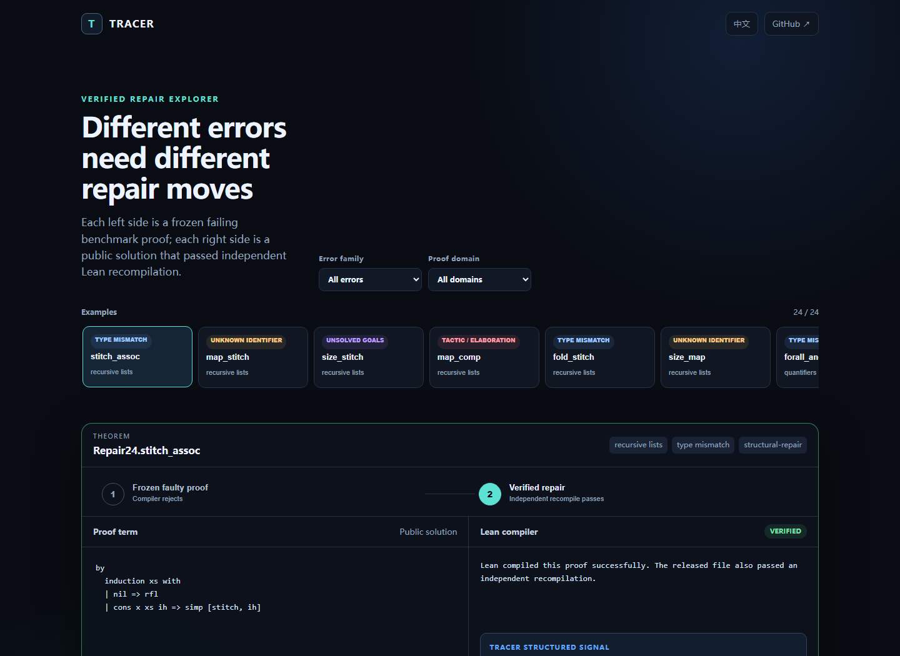
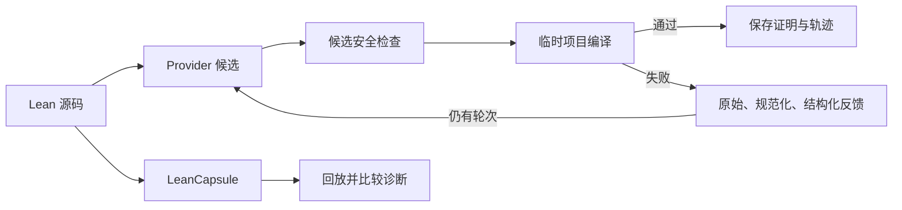
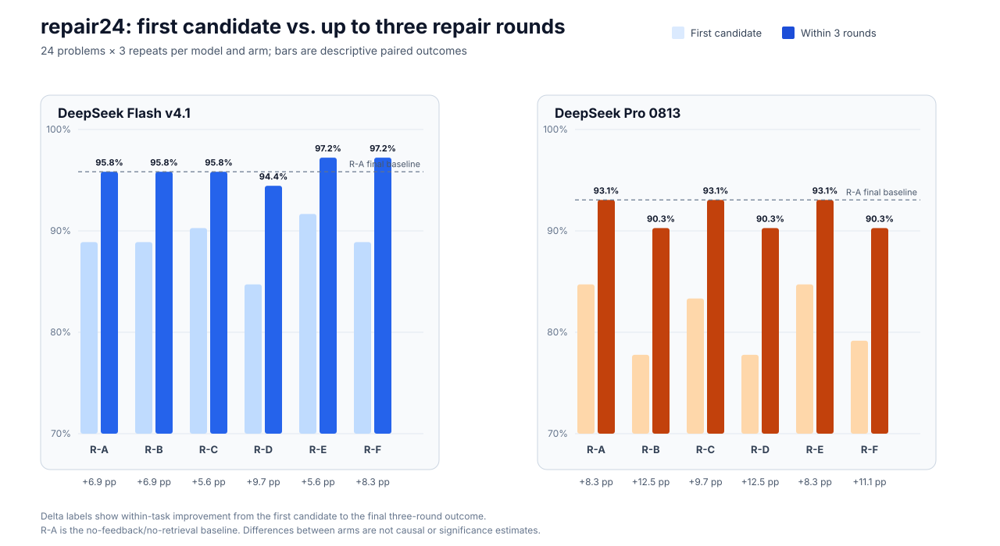

# TRACER

[English](README.md) | **简体中文**

### Typed Repair Agent with Compiler-validated Example Retrieval

**用编译反馈修复 Lean 证明，以可回放失败和可审计证据支撑实验。**

[](https://github.com/runqi-allen-wang/TRACER-Typed-Repair-Agent-with-Compiler-validated-Example-Retrieval/actions/workflows/ci.yml)
[](lean-toolchain)
[](LICENSE)

> [!IMPORTANT]
> **[打开 TRACER 交互式 Demo](https://runqi-allen-wang.github.io/TRACER-Typed-Repair-Agent-with-Compiler-validated-Example-Retrieval/)** —— 浏览 24 组经过验证的 Lean 修复，覆盖五类证明领域和四类诊断错误；可以筛选案例、查看编译反馈，并在冻结失败证明与独立复编译通过的解之间切换。无需安装，也无需 API key。



[交互演示](#60-秒体验-tracer) · [快速开始](#快速开始) · [最新结果](#最新已发布结果) · [证据状态](PROGRESS.md) · [API 指南](docs/API_GUIDE.md) · [失败案例库](capsules/index.md) · [参与贡献](CONTRIBUTING.md)


TRACER 是面向 **Lean 4 证明修复、编译反馈实验与失败复现**的研究工具。它在目标项目环境中编译每个候选，记录逐轮诊断和检索示例，并保存成功证明供独立复编译。LeanCapsule 把失败整理成可移植、可审计的回归案例。

> TRACER 不训练或微调模型。项目研究推理阶段的证明修复，以及区分“证明编译通过”“失败被复现”和“研究结论有证据支持”所需的实验基础设施。

## 60 秒体验 TRACER

**[打开交互式网页 Demo](https://runqi-allen-wang.github.io/TRACER-Typed-Repair-Agent-with-Compiler-validated-Example-Retrieval/)** · [查看网页源码](demo/) · [查看对应审计发布包](published/research-six-arm-313f437f)

Demo 是一个由静态公开证据驱动的动态浏览器界面。它包含全部 24 组 `repair24` 失败/成功证明，覆盖递归列表、量词、函数、Option 和自然数递归，以及类型不匹配、未知标识符、未解决目标和策略/elaboration 错误。这里的“动态”指浏览器交互，不是在线调用模型：网页不需要 API key、不上传代码，也不会发起网络请求。克隆仓库后，可用下面的命令在本地打开同一页面：

```text
python demo/serve.py
```

页面还会明确解释 TRACER 改进的环节：隔离的证明区域补丁、原始/规范化/结构化编译反馈、随错误变化的检索、有界重试，以及带证据保存的 Lean 内核验证。在已发布的 864 个任务实例中，第一轮通过 **735/864（85.1%）**，最多三轮后通过 **811/864（93.9%）**；有界修复循环额外挽回 76 个任务实例，即 **+8.8 个百分点**。这只是首轮到末轮的描述性转化，不是 TRACER 因果效应估计；下方本地快速开始会调用真实 Lean 编译器。

## 实验与安全命名体系

| 命名空间 | 含义 | 当前状态 |
| --- | --- | --- |
| **R-A / R-B / R-C / R-D / R-E / R-F** | repair24 的反馈与检索研究臂 | 预注册的 864 任务矩阵已完成并发布 |
| **SP-1～SP-12** | 带正常对照的编译前安全策略 | 离线策略套件已发布；操作系统隔离证据待完成 |

为兼容现有脚本和记录，研究臂的存储值仍是 `A/B/C/D/C_dynamic/C_failure`。公开讨论使用 R-A～R-F；SP 是安全策略，不是额外实验组。完整定义见[研究协议](docs/RESEARCH_PROTOCOL.md)和[安全策略](docs/security_policy.md)。

## 当前状态

- **repair24 六臂实验：** 预注册的 864 任务矩阵已经完成；发布包包含 1,066 条脱敏逐轮记录、811 个成功证明、AI 辅助复核账本和可复现审计合同。
- **Compiler Feedback Study v1：** 早期两批 216 任务实验继续作为反馈表示研究的辅助证据；其中 408 个成功证明均已独立复编译。
- **TRACER-REAL v2：** 六个上游项目的 1,576 个冻结历史候选已全部筛查：**256 个纳入、1,320 个拒绝**，provider 调用为零。SciLean 的 2/54 项低于每项目五题门槛，最终确认性 test 划分冻结为**五个独立项目、254 道真实修复题**。PhysLean 占 94/254（37.0%）；一份在 provider 调用前公开的修订将探索阶段的 35% 集中度上限调整为 40%，不删题且不改变其他门槛。最终 265 题 manifest（development 3、validation 8、test 254）及精确运行时预注册均已冻结并通过审计。参见[原始纳入合同](benchmarks/real_repairs/tracer_real_v2.enrollment.json)、[v2 协议与修订](docs/TRACER_REAL_V2.md)、[最终 manifest](benchmarks/real_repairs/tracer_real_v2/manifest.json)和[运行时预注册](experiments/preregistrations/tracer_real_causal_v2.json)。
- **LeanCapsule：** 24 个复核案例覆盖 Std、Mathlib 与 project-local 环境；另有 12-core / 4-challenge 套件验证干净目录回放。
- **编译反馈与安全：** 三层诊断协议、[反馈采纳审计](docs/FEEDBACK_ADOPTION_V1.md)、[反馈实验协议](docs/FEEDBACK_STUDY_V1.md)和 SP-1～SP-12 门禁均已实现。容器和低权限隔离仍是待补证据。

## 快速开始

需要 Python 3.11+、Git，以及通过 `elan` 安装的 Lean。仓库在 [lean-toolchain](lean-toolchain) 中固定 Lean 版本。

```text
git clone https://github.com/runqi-allen-wang/TRACER-Typed-Repair-Agent-with-Compiler-validated-Example-Retrieval.git tracer
cd tracer
python -m pip install -r requirements.txt
lake build
```

无需调用模型 API，先回放一个失败：

```text
python -m leancapsule replay capsules/std/unknown-identifier
```

对于失败 Capsule，`ok: true` 表示预期错误成功复现，不表示 Lean 文件编译成功。

用指定的 mock 候选检查证明补丁、编译和保存链路：

```text
python src/agent.py solve --file lean_project/Benchmarks/Evaluation18.lean --theorem Eval18.and_swap_eval --condition B --provider mock --mock-candidate "by intro h; exact And.intro h.right h.left"
```

运行一次真实 DeepSeek 请求。密钥输入不会回显或写入结果；读取后**只显示字符数和末四位**。

```text
python src/agent.py solve --file lean_project/Benchmarks/Evaluation18.lean --theorem Eval18.and_swap_eval --condition B --provider openai_compatible --api-url "https://api.deepseek.com/chat/completions" --model deepseek-v4-pro --temperature 0 --max-tokens 12000 --api-key-prompt --max-rounds 3 --timeout 60
```

真实请求可能产生费用。不要把密钥写进命令、脚本、提交、Issue 或结果文件。Responses API、GPT 示例、自定义 provider、本地 HTTP 接口和故障排查见 [API 指南](docs/API_GUIDE.md)。

判断失败时应注意：`provider_error` 表示请求没有产生可用候选；编译诊断类别表示候选已经到达 Lean。`compile_ok: false` 本身不代表 API 损坏，应先检查 `diagnostic` 再决定是否重试。

## 工作原理



Agent 成功表示候选通过 Lean 和未完成证明检查；Capsule 成功表示预期编译状态与诊断被复现。两者不是同一种结果。

## 最新已发布结果

最新发布冻结了 24 道 repair24 题目 × 两个 DeepSeek 模型配置 × 三次重复 × 六个研究臂，共 **864 个任务实例**；每项最多三轮。



> 图中的“前后”指同一任务的首轮候选与最多三轮修复后的结果；R-A 是不提供反馈和检索的基线。该图只做描述性展示，不能解读为 TRACER 的因果处理效应。

| 模型配置 | 研究臂 | 失败后提供的信息 | pass@1 | 三轮内成功 |
| --- | --- | --- | ---: | ---: |
| DeepSeek Flash v4.1 | R-A | 无 | 64/72（88.9%） | 69/72（95.8%） |
| DeepSeek Flash v4.1 | R-B | 编译反馈 | 64/72（88.9%） | 69/72（95.8%） |
| DeepSeek Flash v4.1 | R-C | 反馈＋固定检索 | 65/72（90.3%） | 69/72（95.8%） |
| DeepSeek Flash v4.1 | R-D | 仅固定检索 | 61/72（84.7%） | 68/72（94.4%） |
| DeepSeek Flash v4.1 | R-E | 反馈＋随诊断变化的检索 | 66/72（91.7%） | 70/72（97.2%） |
| DeepSeek Flash v4.1 | R-F | R-E＋失败 Capsule 上下文 | 64/72（88.9%） | 70/72（97.2%） |
| DeepSeek Pro 0813 | R-A | 无 | 61/72（84.7%） | 67/72（93.1%） |
| DeepSeek Pro 0813 | R-B | 编译反馈 | 56/72（77.8%） | 65/72（90.3%） |
| DeepSeek Pro 0813 | R-C | 反馈＋固定检索 | 60/72（83.3%） | 67/72（93.1%） |
| DeepSeek Pro 0813 | R-D | 仅固定检索 | 56/72（77.8%） | 65/72（90.3%） |
| DeepSeek Pro 0813 | R-E | 反馈＋随诊断变化的检索 | 61/72（84.7%） | 67/72（93.1%） |
| DeepSeek Pro 0813 | R-F | R-E＋失败 Capsule 上下文 | 57/72（79.2%） | 65/72（90.3%） |

证据：[经过审计的六臂发布包](published/research-six-arm-313f437f)。包内有 864 条任务摘要、1,066 条脱敏逐轮记录、811 个独立复编译证明和 864 行复核记录；全部 811 个成功证明通过 AI 辅助检查。运行期报告 5 次传输重试，发布时实测 6 个归档尝试目录、10 条失败轮次，另有 1 次调用预留没有轮次记录；发布包同时披露这些数字，没有静默改写历史。

预注册的主比较 R-B 减 R-A，在三轮内成功率上 Flash 为 **0.0 个百分点**，Pro 为 **−2.8 个百分点**。R-E/R-F 在 Flash 上达到最高观测值，但在 Pro 上没有复现。以上只是 24 道独立题、同一供应商模型族内的描述性结果；重复和实验臂是配对观测，不是新的独立题目。本批记录 5,116,954 tokens，按冻结配置估算约 13.39 美元，但这不是供应商账单。不能据此声称因果优势、统计显著、跨供应商泛化或 SOTA。

## 证据与边界

| 范围 | 当前有证据支持的内容 | 重要边界 |
| --- | --- | --- |
| repair24 六臂实验 | 通过审计的 864 任务发布；811 个证明独立复编译 | AI 辅助复核；仅 24 道独立题且属于同一供应商模型族 |
| 早期反馈表示实验 | 两批通过审计的 216 任务发布；408 个证明独立复编译 | 辅助历史证据，不是当前最新主结果 |
| TRACER-REAL v2 | 六个项目全部筛查；最终 manifest 冻结五个独立测试项目、254 道修复题 | 40% 占比门槛是 provider 前对原 35% 的公开修订；尚无 v2 provider 结果 |
| LeanCapsule | 24/24 gallery 回放、16/16 feasibility 回放 | 复现预期失败不等于修复证明 |
| 安全 | [SP v2 发布包](published/security-study-tracer-sp-v2)：危险候选误放行 0/12，正常对照误拒绝 0/8 | 小规模冻结套件不是操作系统沙箱，也不代表零风险 |

统一证据登记见 [PROGRESS.md](PROGRESS.md)；历史变更和已被取代的工程基线保留在 [CHANGELOG.md](CHANGELOG.md)。

## 验证

以下核心检查不会调用付费模型 API：

```text
lake build
python -m unittest discover -s tests -v
python -m leancapsule audit capsules
python -m leancapsule verify capsules
```

`audit` 检查工件结构和发布策略，`verify` 回放预期行为；两者都不能替代模型实验或数学复核。

## 关键文档

| 主题 | 文档 |
| --- | --- |
| Provider/API 配置 | [API 指南](docs/API_GUIDE.md) |
| Compiler Feedback v1 | [诊断协议](docs/COMPILER_FEEDBACK_V1.md) · [反馈采纳](docs/FEEDBACK_ADOPTION_V1.md) · [反馈实验](docs/FEEDBACK_STUDY_V1.md) |
| 因果对照与 R-A～R-F | [因果反馈](docs/CAUSAL_FEEDBACK_V1.md) · [研究协议](docs/RESEARCH_PROTOCOL.md) |
| 真实历史修复 | [TRACER-REAL 构建器](benchmarks/real_repairs/README.md) · [v2 纳入](docs/TRACER_REAL_V2.md) |
| 失败工件 | [Capsule 格式](docs/CAPSULE_FORMAT.md) · [案例库](capsules/index.md) |
| 安全 | [SP 策略](docs/security_policy.md) · [隔离协议](docs/SP_ISOLATION_V1.md) |
| 研究背景 | [相关工作](docs/RELATED_WORK.md) |

## 下一步证据

1. 按已经冻结的 TRACER-REAL v2 manifest 与运行时预注册执行 provider 实验，不再修改题目、提示、生成参数或项目等权分析。
2. 发布结果时同时交付完整轨迹、独立复编译证明、复核方式、基础设施错误和 35%→40% 门禁修订。
3. 分别生成原生 Linux 与 Windows Docker Desktop 的 SP 隔离证据。
4. 在反馈对照和安全边界稳定后，再评估自适应路由策略。

以上均为计划，不是已完成结果。

## 引用、许可与致谢

研究或教学使用时，请引用 [CITATION.cff](CITATION.cff)，并注明仓库版本和实验批次。TRACER 采用 [MIT License](LICENSE)；各 Capsule 保留自身记录的来源许可。

感谢 [SJTU AI4Math Summer School 2026](https://sjtu-ai4math.github.io/summer-school/2026/) 提供学习与协作平台，也感谢 [subfish-zhou](https://github.com/subfish-zhou) 与 [Fulcrum-Nebula](https://github.com/Fulcrum-Nebula) 对编译反馈和 SP 研究方向提出建议。
