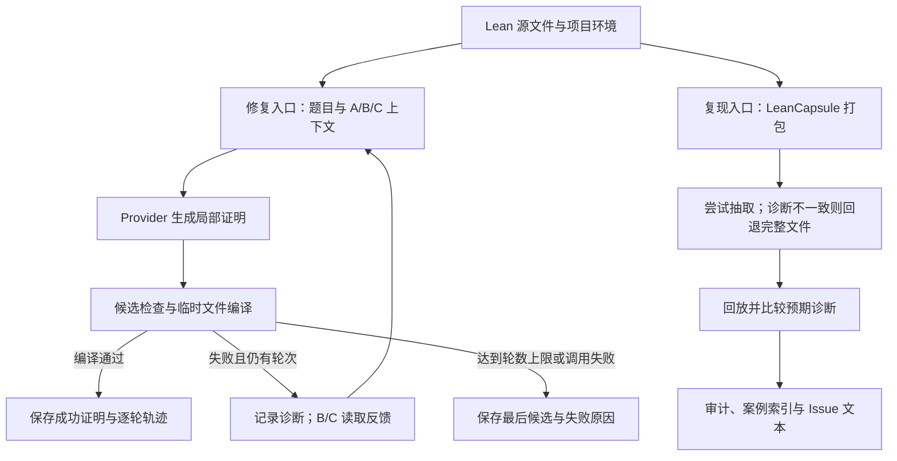

# TRACER

[English](README.md) | **简体中文**

### Typed Repair Agent with Compiler-validated Example Retrieval

**让 Lean 证明修复有反馈，让失败案例可回放，让实验结论有据可查。**

[](https://github.com/runqi-allen-wang/TRACER-Typed-Repair-Agent-with-Compiler-validated-Example-Retrieval/actions/workflows/ci.yml)
[](lean-toolchain)
[](.github/workflows/ci.yml)

[快速开始](#快速开始) · [创新点与工程贡献](#创新点与工程贡献) · [实验结果](#实验结果) · [API 指南](docs/API_GUIDE.md) · [失败案例库](capsules/index.md) · [参与贡献](CONTRIBUTING.md)


TRACER 是面向 **Lean 4 形式化证明的修复、复现与评测研究工具**。它将语言模型候选、Lean 编译反馈、本地示例检索和逐轮实验记录连接起来，并通过 **LeanCapsule** 把失败现场整理成可分享、可回放、可审计的工件。

项目包含两条互补路径：你可以只用 LeanCapsule 复现一个错误，**完全不需要模型 API**；也可以接入真实 provider，运行有界证明修复与 A/B/C 对照实验。两条路径共用编译与诊断基础设施，但拥有各自的入口和验收标准。

> **研究定位：** 本项目不训练或微调模型。重点是推理阶段的反馈组织、局部修复，以及实验与失败案例的可复现交付，为方法研究提供可替换、可检查的实验基础设施。

目前可直接查看的交付：

- **24 个公开失败 capsule**：覆盖 4 类错误家族，来源包括 Std、Mathlib 和项目本地依赖。
- **18 道冻结题 × 3 个实验条件**：已发布一批真实 provider pilot，包含 56 条逐轮记录和 54 个成功证明文件。
- **完整操作链**：单题 CLI、本地 HTTP API、批量评测、人工复核、报告校验与脱敏导出。

实验范围及结论限制见下文，不将上述数量视为通用证明能力或性能领先的证据。

## 为什么需要 TRACER

修复一个 Lean 证明，常常需要回答三类不同的问题：

1. **为什么失败？** 是名字未解析、类型不匹配、实例推断失败，还是目标未完成？
2. **别人能复现吗？** 只有报错截图或一段 proof，通常不足以说明工具链版本、imports 和局部上下文。
3. **改进真的有效吗？** 成功率数字需要能追溯到题目、模型配置、候选、编译诊断和最终证明，而不是只看一次终端输出。

TRACER 将这三类问题分开处理，再通过可读记录连接起来。对开发者，它提供可重新编译的修复产物；对研究者，它提供检查实验设置和失败过程的依据；对协作者，它提供可以回放的错误现场。

## 创新点与工程贡献

这里的“创新点”指本项目的设计组合与可核查工程贡献，不声称首创编译反馈、检索增强或自动定理证明方法。

| 设计重点 | 本项目如何实现 | 带来的价值 |
| --- | --- | --- |
| **把失败作为独立交付物** | LeanCapsule 同时保存 Lean 文件、环境信息、预期诊断、来源与回放入口 | 错误可以被分享、复现和加入回归案例，而不依赖原作者的终端状态 |
| **以编译验证约束案例抽取** | 按定理抽取后重新编译；诊断不一致则回退完整文件；在预算内尝试删除 imports | 缩小案例时仍检查是否保留原来的失败现象，不把“文件更短”误当作复现成功 |
| **可控的推理时修复** | 局部候选生成 → 安全检查 → 项目环境编译 → 有界诊断反馈，最多三轮 | 在不改模型权重的前提下研究反馈与示例的作用；原题文件不被覆盖 |
| **从结果数字追溯到证据** | 记录模型配置、候选、实际检索示例、usage 与编译诊断；成功证明落盘；正式报告前做严格校验 | 降低批次混合、缓存复用或基础设施错误被误当作能力提升的风险 |

对应实现：[修复循环](src/agent.py) · [capsule 打包](src/leancapsule/pack.py) · [imports 精简](src/leancapsule/minimize.py) · [pilot 校验](scripts/validate_pilot.py) · [发布导出](scripts/export_pilot.py)。

## 工作原理



两条入口可独立使用。当前 Agent 不会自动把每次失败打包成 capsule；如需将一个失败案例纳入 gallery，应显式调用 `pack` 并补齐来源与复核信息。

**两种“通过”的含义不同：**

- **Agent 成功**：候选证明通过 Lean 编译和项目的未完成证明检查。
- **Capsule 回放成功**：实际编译状态、诊断类别与规范化诊断文本符合预期。一个预期编译失败的案例，正确重现该错误就算回放通过。

因此，gallery 的 24/24 回放通过不等于 24 个证明被模型解出，也不应与 A/B/C 修复成功率混用。

## 适合谁使用

- **Lean 使用者与维护者**：将错误整理成带环境与复现步骤的 Issue 附件，减少“在我的机器上无法复现”的沟通。
- **形式化数学与 AI4Math 研究者**：复用冻结题目、提示模板和逐轮轨迹，比较推理时反馈策略。
- **Agent 开发者**：通过 provider 接口替换生成端，以 Lean 编译结果检验局部修复，而不是仅按模型自述判断成功。
- **课程与小型研究团队**：从无需 API 的失败回放开始，再进入真实模型实验和人工复核。

## 快速开始

### 1. 准备环境

请先安装 Python、Git 与 Lean 工具链管理器，并保证 `python`、`lean`、`lake` 可在当前终端使用。仓库的 [lean-toolchain](lean-toolchain) 固定 Lean 4.32.0；CI 使用 Python 3.11。Python 依赖安装不会替你安装 Lean。

首次获取仓库：

```bash
git clone https://github.com/runqi-allen-wang/TRACER-Typed-Repair-Agent-with-Compiler-validated-Example-Retrieval.git tracer
cd tracer
```

已有本地仓库时，直接进入仓库根目录。以下单行命令均可在 PowerShell 或 Git Bash 中运行：

```text
python -m pip install -r requirements.txt
lake build
```

PowerShell 若提示找不到 `ELAN_HOME`，请为当前终端设置现有工具链目录后重试：

```powershell
$env:ELAN_HOME = "$env:USERPROFILE\.elan"
```

### 2. 无需 API，先回放一个失败案例

```text
python -m leancapsule replay capsules/std/unknown-identifier
```

该案例预期出现 unknown identifier 错误。输出 JSON 的 `ok: true` 表示**成功复现预期错误**，不是源文件已经编译成功。

也可以从仓库提供的失败输入生成一个新 capsule；这里写入 `results/`，避免覆盖公开案例：

```text
python -m leancapsule pack --project . --file examples/capsule_failures/unknown_identifier.lean --lines 1:7 --out results/capsules/unknown-identifier
python -m leancapsule replay results/capsules/unknown-identifier
python -m leancapsule issue results/capsules/unknown-identifier --out results/capsules/unknown-identifier/issue.md
```

新生成的 capsule 只是本地复现工件。公开发布前，仍需补充分类、来源、许可和人工复核，不能将 `pack` 成功等同于发布审计通过。格式见 [LeanCapsule 工件说明](docs/CAPSULE_FORMAT.md)。

### 3. 无需 API，检查证明修复链路

```text
python src/agent.py solve --file lean_project/Benchmarks/Evaluation18.lean --theorem Eval18.and_swap_eval --condition B --provider mock --mock-candidate "by intro h; exact And.intro h.right h.left"
```

`mock` 只用于验证补丁、编译与保存链路；这里的候选由用户提供，**不是模型实验结果**。目标可以使用 `-- PROOF_START` / `-- PROOF_END` 标记，也可以使用目标定理内唯一的 `sorry` 占位符。成功文件写入 `results/solutions/`，原文件保持不变。

## 接入真实模型

完整配置见 [模型 API 使用指南](docs/API_GUIDE.md)：包括 DeepSeek V4 Pro/Flash、OpenAI GPT、环境变量、PowerShell / Git Bash、本地 HTTP 接口及常见错误。

当前内置 `openai_compatible` provider 同时支持 **Chat Completions** 与 **Responses API**。使用 `--wire-api responses` 选择 Responses，并显式设置推理强度和响应存储策略；模型名、接口地址和密钥仍需来自同一服务。

### DeepSeek

```text
python src/agent.py solve --file lean_project/Benchmarks/Evaluation18.lean --theorem Eval18.and_swap_eval --condition B --provider openai_compatible --api-url "https://api.deepseek.com/chat/completions" --model deepseek-v4-pro --temperature 0 --max-tokens 12000 --api-key-prompt --max-rounds 3 --timeout 60
```

### OpenAI GPT

```text
python src/agent.py solve --file lean_project/Benchmarks/Evaluation18.lean --theorem Eval18.and_swap_eval --condition B --provider openai_compatible --api-url "https://api.openai.com/v1/chat/completions" --model gpt-4.1 --temperature 0 --max-tokens 4000 --api-key-prompt --max-rounds 3 --timeout 60
```

输入密钥时终端不会回显，读取后只显示字符数和末四位。不要将完整密钥写进脚本、README、提交消息或 Issue。真实 API 调用可能产生费用。

DeepSeek Flash 可将模型改为 `deepseek-v4-flash`。GPT-4.1 是当前请求结构的兼容示例，不是“最新模型推荐”；GPT-5 等模型的参数不能直接照搬。两个示例的输出预算不同，不构成等预算比较。DeepSeek 思考模式下温度参数不生效，详细限制与官方依据见 API 指南。

项目还提供：

- **命令 provider**：通过 `--provider command --provider-command ...` 对接自定义生成程序；输入输出约定见 API 指南。
- **本地 HTTP 接口**：运行 `python src/api_server.py --host 127.0.0.1 --port 8765`，再向 `POST /solve` 发送 JSON 配置。该接口不是面向公网的鉴权服务，请保留在可信本地环境中使用。

### 如何判断失败位置

- 出现 `provider_error`：请求没有产生可进入 Lean 编译的候选，应检查地址、模型、密钥、额度或网络。
- 出现 `diagnostic.category = syntax/type/goal` 等编译诊断：候选进入了编译检查，不能仅据此判定 API 损坏。
- `compile_ok: false` 本身不代表 API 损坏；应同时阅读 `diagnostic`。
- 模型返回的 Markdown 代码围栏会在编译前的候选清洗中移除；历史缓存候选也执行相同清洗。

单题运行的候选、模型 usage、缓存命中和编译诊断记录在 `results/agent_runs.jsonl`。成功证明写入 `results/solutions/`，持续失败的最后候选写入 `results/solutions/failures/`。

## 实验设计

冻结评测集为 [Evaluation18.lean](lean_project/Benchmarks/Evaluation18.lean)，题目 ID、标签与难度见 [benchmark manifest](benchmarks/manifest.json)。**18 道不同题目 × 3 个条件 = 54 个任务组合**，不是 54 道独立题目。

| 条件 | 模型读取的上下文 | 研究问题 |
| --- | --- | --- |
| **A：题目** | 定理与目标局部代码，不加入历史编译诊断或检索示例 | 基础生成在同样轮数预算下能做到什么？ |
| **B：题目 + 反馈** | A，加上上一轮有界编译诊断 | 编译反馈能否帮助修正前一轮候选？ |
| **C：题目 + 反馈 + 检索** | B，加上 Top-3 本地示例文本 | 在反馈之外，相近示例是否值得额外 token 成本？ |

三组保持模型、输出预算、编译器、超时、题目顺序和最多三轮等设置一致，只改变提示上下文。A 也可以进行多轮生成，但不读取上一轮诊断；B/C 的第一轮尚无真实的上一轮反馈。

评测不依赖运行时答案表。检索会检查与评测题声明相同的示例；相似但不相同的命题仍需人工复核，**文本去重不等于消除了所有语义泄漏风险**。这里的 `pass@3` 指三轮预算内至少一次成功的题目比例，不是多次独立采样得到的无偏 pass@k 估计。方法详见 [实验协议](docs/methodology.md)。

### AxProverBase Part 1 + Part 2 配对实验

另一组 FATE-M 实验比较 Part 1 的 AxProverBase `ExperienceProcessor` baseline 与 Part 2 的 `MemorylessProcessor + CapsuleFeedback`。两组在 25 题上逐题复用相同首轮候选，并冻结 `gpt-5.6-sol`、AI4Math `yxai` Responses endpoint、预算和候选安全策略。两组均为 25/25 成功；总轮次由 39 降至 36，编译错误由 14 降至 11，LLM 调用由 79 降至 36，token 由 656,657 降至 274,742；Capsule 处理本身没有额外 LLM 或编译调用。详见 [Part 2 设计](docs/part2_capsule_feedback.md)与[正式结果交接包](results/handoff/part12-live-20260828-corrected/README.md)。

## 实验结果

以下是已发布 pilot `pilot-20260826T122354Z-d628742d` 的结果，不是本次 README 更新重新运行的实验。配置为 `deepseek-v4-pro`、请求温度 0、最大输出 12,000 token、最多三轮。

| 条件 | 任务数 | pass@1 | pass@3 | 平均轮次 | 平均总 token / 任务 |
| --- | ---: | ---: | ---: | ---: | ---: |
| A：题目 | 18 | 18/18（100.0%） | 18/18（100.0%） | 1.000 | 1,750.4 |
| B：题目 + 反馈 | 18 | 16/18（88.9%） | 18/18（100.0%） | 1.111 | 1,841.9 |
| C：题目 + 反馈 + 检索 | 18 | 18/18（100.0%） | 18/18（100.0%） | 1.000 | 2,906.1 |

平均总 token 先累加每题各轮的 provider usage，再对该条件的 18 个任务取平均；不是只统计成功的最后一轮。

这批交付包含 **56 条逐轮记录、54 个成功证明文件，缓存命中为 0**。未配置 token 单价，成本为 `unknown`，不能解释为零成本。

**如何理解这些结果：**

- 它提供了“真实 provider → 编译检查 → 证明保存 → 复核与导出”链路的运行证据。
- A 已在首轮达到 18/18，存在明显的天花板效应；本批数据**没有证明 B/C 带来最终成功率提升**。C 消耗了更多 token，也不能据此声称更高效。
- 18 题、单模型、单批次不足以支持通用自动定理证明、统计显著优势或 SOTA 结论。即便 18/18 成功，对应 Wilson 95% 区间仍约为 82.4%–100.0%。
- 复现最终证明的编译检查，不等于保证再次调用同一模型会得到逐字相同的输出。服务端默认设置和生成波动需要在实验中披露。

**查看证据：** [完整报告](published/pilot-20260826T122354Z-d628742d/REPORT.md) · [逐轮脱敏轨迹](published/pilot-20260826T122354Z-d628742d/real_pilot_runs.sanitized.jsonl) · [成功证明](published/pilot-20260826T122354Z-d628742d/solutions) · [人工复核](published/pilot-20260826T122354Z-d628742d/manual_review.csv) · [交付清单](published/pilot-20260826T122354Z-d628742d/handoff.json)。

### 运行自己的正式实验

操作手册见 [真实 pilot 生成、复核与导出指南](docs/REAL_PILOT_GUIDE.md)。每个模型独立运行并导出一批；不要混用不同模型、预算或不同批次的日志。

<details>
<summary>展开：完整 pilot 与正式发布命令（PowerShell）</summary>

先运行冻结集。这会调用真实模型并产生费用。`--fresh` 会把旧日志、证明、复核表和报告移入可恢复的 `results/archive/`，并默认清空持久请求缓存：

```powershell
python src/evaluate.py --provider openai_compatible --api-url "https://api.deepseek.com/chat/completions" --model deepseek-v4-pro --temperature 0 --max-tokens 12000 --api-key-prompt --conditions A,B,C --max-rounds 3 --timeout 60 --fresh
```

完成本批 `results/manual_review.csv` 的逐题人工复核，再执行：

```powershell
python scripts/validate_pilot.py --runs results/real_pilot_runs.jsonl --require-manual-review
if ($LASTEXITCODE -ne 0) { throw "校验未通过，停止发布" }
python src/report.py
if ($LASTEXITCODE -ne 0) { throw "报告生成失败，停止导出" }
python scripts/export_pilot.py --out published/deepseek-v4-pro-12000-run01
```

导出目录必须尚不存在。校验检查任务完整性、连续轮次、配置一致性、缓存命中和基础设施错误；formal 报告还要求人工复核与证明工件。复核不能仅为通过校验而批量填入 PASS。

如果显式使用 `--reuse-cache`，结果不能作为严格 fresh 实验，应保留相应警告并按草稿处理。发布使用脱敏导出，不直接上传原始日志、SQLite 或历史归档。

</details>

## LeanCapsule 失败案例库

LeanCapsule 提供一个**以诊断一致性为中心的失败复现协议**。它既保留供人阅读的原始错误正文，也提供去除本机路径、行列号和不稳定编号后的可读诊断键，用于机器核验。诊断键文本一致只是操作层面的复现标准，不宣称不同文件的数学或程序语义等价。

当前 [gallery](capsules/index.md) 有 24 个案例：

| 错误家族 | 数量 | 常见问题 |
| --- | ---: | --- |
| Name / import | 7 | 未知标识符、namespace 或导入缺失 |
| Type / application | 5 | 类型不匹配、函数应用或隐式参数问题 |
| Elaboration / instance | 5 | 实例推断、metavariable 或强制转换问题 |
| Goal / scope | 7 | 未解决目标、局部上下文或作用域问题 |

来源分布：**Std 14 · Mathlib 4 · project-local 6**。索引同时提供 [JSON](capsules/index.json)、[CSV](capsules/index.csv) 和 [Markdown](capsules/index.md)；[复核台账](capsules/MANUAL_REVIEW.csv)记录来源、语义与敏感内容检查。

使用 `--theorem` 打包时，会尝试生成包含 imports、namespace 和目标定理的 standalone 文件；编译状态或规范化诊断发生变化则回退完整文件。standalone 验证后再进行有编译预算的 imports 精简，可用 `--no-minimize-imports` 关闭。通过 `--lines` 指定的范围用于记录目标，目前不是任意语义切片功能。

### Mathlib 环境

Mathlib 案例使用独立的 [mathlib_project](mathlib_project) 依赖工程。首次回放前准备固定版本依赖：

```powershell
./scripts/setup_mathlib.ps1
```

Linux/macOS：

```bash
bash scripts/setup_mathlib.sh
```

依赖和预编译缓存不纳入仓库。Bash 安装脚本对依赖同步和缓存下载分别最多尝试三次，失败后依次等待 5 秒、10 秒；重试同步前，将没有有效 HEAD 的残缺 Git 包移入 `.lake/retry-backups/`，保留可恢复备份，不移动有效仓库、链接包或无 Git 的本地依赖。每次失败保留原始错误，重试耗尽仍使 CI 失败；CI 安装步骤设有 30 分钟总超时，不关闭证书校验。

Bash 入口可通过 `TRACER_SETUP_ATTEMPTS`（1–5 次）和 `TRACER_SETUP_RETRY_DELAY`（初始 0–30 秒）调整重试；未显式配置 `MATHLIB_CACHE_DIR` 时，缓存位于项目的 `.lake/mathlib-cache`。这些重试配置不适用于 PowerShell 脚本。Windows 的工具链目录应写为 `$env:ELAN_HOME = "$env:USERPROFILE\.elan"`，注意用户名目录与 `.elan` 之间的分隔符；需要本地代理时再配置 `HTTP_PROXY` / `HTTPS_PROXY`。

没有网络或尚未准备 Mathlib 依赖时，可先回放 Std 与 project-local 案例；这不等于 Mathlib 案例已经验收。回放默认超时为 180 秒。

## 测试与质量检查

以下检查不调用付费模型 API，但端到端测试仍需要真实 Lean 工具链：

```text
lake build
python scripts/run_ci_tests.py
python -m leancapsule audit capsules
```

在准备 Mathlib 依赖后，全量回放：

```text
python -m leancapsule verify capsules
```

更新索引：

```text
python -m leancapsule gallery capsules --out capsules/index.json
```

[CI 工作流](.github/workflows/ci.yml)执行工具链安装、Lean 构建、Python 检查与测试、发布静态审计、Mathlib 依赖准备和全量回放。状态徽章链接到真实 Actions 记录，不以固定的“全部通过”文字替代运行状态。

需要特别区分：

- `audit` 检查文件布局、schema、来源许可、敏感信息、未完成证明及复核台账，**不替代编译回放**。
- `verify` 检查预期失败是否能复现，**不替代真实模型评测**。
- `validate_pilot.py` 与人工复核检查实验交付，**不替代数学假设和示例泄漏的实质审查**。

## 安全与能力边界

- **不是操作系统沙箱。** 临时 HOME/TMP/APPDATA、最小环境变量和候选策略只提供防护层。运行不受信任的项目或 Lean 代码，应使用容器、虚拟机或独立低权限环境。
- **限制局部修复。** Agent 不应改写题目 imports 或定理头；候选中的 `sorry`、`admit`、`sorryAx`、未完成证明警告、unsafe 声明和部分显式本机执行构造会被拒绝。D01 验证通过 `unsafe inductive` 构造 `False` 的候选会在 Agent、AxProverBase、Capsule pack、replay 和 audit 编译前被拒绝；它是安全回归，不是 A/B/C 的第四种条件。不承诺任意 Lean 元编程构造都能由文本规则识别。
- **凭据与发布分离。** Provider 限制跨来源重定向并对错误文本脱敏；密钥不作为实验记录字段写入。发布前仍应检查导出内容，并只向可信 provider 发送密钥。
- **透明的比较与缓存。** 诊断比较和请求缓存使用可读的规范化文本，不引入摘要或指纹计算；缓存用于本地调试复用，不充当独立真实采样。
- **抽取不是全局最小化。** 完整文件 fallback 与显式本地文件清单不等于任意多文件项目的程序切片；诊断一致也不保证保留所有上下文语义。
- **工程已有，泛化仍待研究。** 已实现的工具链和发布 pilot 不能替代更大、更难、更多模型与重复运行的实验。当前检索也不等于学习得到的前提选择模型。

## 文档与仓库导航

| 想做什么 | 从这里开始 |
| --- | --- |
| 配置 DeepSeek、GPT 或自定义 provider | [API 使用指南](docs/API_GUIDE.md) |
| 跑真实实验、复核并导出 | [Pilot 手册](docs/REAL_PILOT_GUIDE.md) |
| 理解条件控制和有效性约束 | [方法设计](docs/methodology.md) |
| 查阅逐轮记录字段 | [JSONL 格式](docs/jsonl_schema.md) |
| 创建可公开分享的失败工件 | [工件格式](docs/CAPSULE_FORMAT.md)与[案例贡献指南](docs/CONTRIBUTING_CAPSULES.md) |
| 运行或检查 AxProverBase Part 1 + Part 2 实验 | [Part 1 指南](baseline/README.md)、[Part 2 设计](docs/part2_capsule_feedback.md)与[结果交接包](results/handoff/part12-live-20260828-corrected/README.md) |
| 查看 D01 编译前安全门禁 | [D 类安全回归](docs/security_type_d.md) |
| 查看已发布实验与证明 | [Pilot 交付目录](published/pilot-20260826T122354Z-d628742d) |
| 查看当前状态与历史改动 | [PROGRESS](PROGRESS.md)与[CHANGELOG](CHANGELOG.md) |

```text
src/agent.py           证明修复循环与单题 CLI
src/provider.py        模型接口与候选输出解析
src/compiler.py        Lean 编译与局部证明补丁
src/retriever.py       本地示例检索与命题重合检查
src/leancapsule/       打包、抽取、回放、审计与 Issue 生成
capsule_schema/        capsule manifest 结构定义
capsules/              公开失败案例、索引与复核台账
examples/              本地检索示例及失败输入
benchmarks/            冻结题目元数据
lean_project/          Lean 题目与本地依赖案例
mathlib_project/       独立 Mathlib 依赖工程
prompts/               A/B/C 提示模板
scripts/               依赖准备、测试、pilot 校验与导出
baseline/              AxProverBase Part 1 与配对 Part 2 实验 runner
configs/               冻结的 AxProverBase 模型与 memory 配置
tests/                 自动化测试
results/               本地运行数据与报告
published/             经复核、脱敏的实验交付
docs/                  使用说明与研究方法
```

## 参与贡献与后续研究

欢迎提交可复现失败案例、补充测试、改进诊断整理及模型集成。贡献前请阅读 [CONTRIBUTING](CONTRIBUTING.md)，并为案例补充来源许可、工具链、预期结果与复现步骤。

当前基础上值得进一步检验的方向包括：扩大题目难度与覆盖、跨模型和重复运行比较、不同检索策略的成本收益、对抗性候选测试，以及更强的执行隔离。这些是后续方向，不是已完成能力或性能承诺。

如果修改确实由多人共同完成，请在提交消息中保留 `Co-authored-by: Name <email>`；PR 描述中的 @mention 不替代共同作者记录。

## 引用与许可说明

研究或教学中使用本项目时，请引用 [CITATION.cff](CITATION.cff)，并注明实际使用的版本和实验批次，便于他人追溯。这里提供的是软件引用，不宣称已有对应的同行评审论文或 DOI。

### 致谢

感谢 [SJTU AI4Math Summer School 2026](https://sjtu-ai4math.github.io/summer-school/2026/) 为人工智能与数学交叉领域的学习与交流提供平台。感谢组织者、授课教师及参与者共同营造开放、协作的研究氛围。

本项目采用 [MIT License](LICENSE)。公开案例的来源与许可另见各自的 capsule 元数据。
