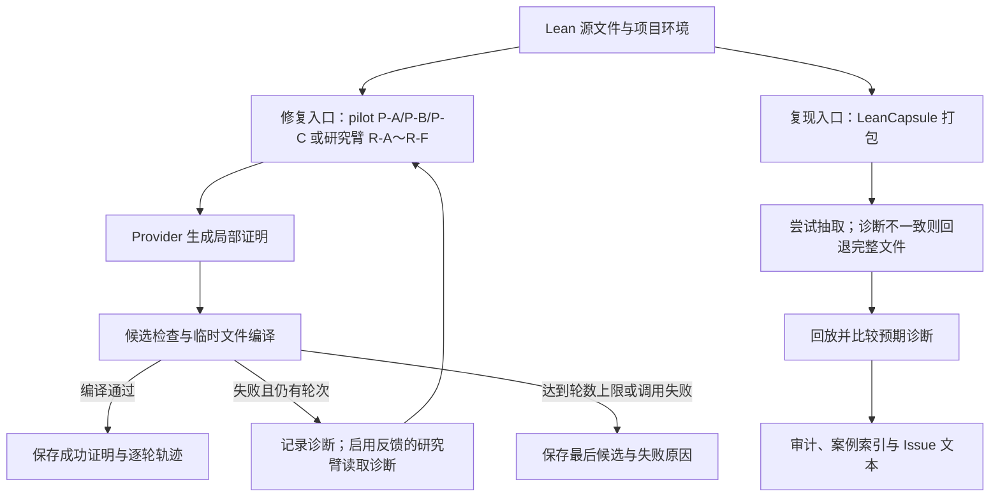

# TRACER

[English](README.md) | **简体中文**

### Typed Repair Agent with Compiler-validated Example Retrieval

**让 Lean 证明修复有反馈，让失败案例可回放，让实验结论有据可查。**

[](https://github.com/runqi-allen-wang/TRACER-Typed-Repair-Agent-with-Compiler-validated-Example-Retrieval/actions/workflows/ci.yml)
[](lean-toolchain)
[](.github/workflows/ci.yml)

[最新结果](#最新已发布结果) · [快速开始](#快速开始) · [命名体系](#实验与安全命名体系) · [创新点与工程贡献](#创新点与工程贡献) · [Compiler Feedback v1](docs/COMPILER_FEEDBACK_V1.md) · [API 指南](docs/API_GUIDE.md) · [失败案例库](capsules/index.md) · [参与贡献](CONTRIBUTING.md)


TRACER 是面向 **Lean 4 形式化证明的修复、复现与评测研究工具**。它将语言模型候选、Lean 编译反馈、本地示例检索和逐轮实验记录连接起来，并通过 **LeanCapsule** 把失败现场整理成可分享、可回放、可审计的工件。

项目包含两条互补路径：你可以只用 LeanCapsule 复现一个错误，**完全不需要模型 API**；也可以接入真实 provider，运行有界证明修复。公开文档将已发布 smoke pilot 记为 P-A/P-B/P-C，同时保留底层历史存储值 A/B/C；当前 repair24 研究协议则使用相互独立的 R-A～R-F 六个研究臂。两条路径共用编译与诊断基础设施，但拥有各自的入口和验收标准。

> **研究定位：** 本项目不训练或微调模型。重点是推理阶段的反馈组织、局部修复，以及实验与失败案例的可复现交付，为方法研究提供可替换、可检查的实验基础设施。

## 实验与安全命名体系

TRACER 刻意分开三套命名。它们对应不同层级的证据，不能拼成一列连续实验组。

| 命名空间 | 成员 | 用途 | 当前证据状态 |
| --- | --- | --- | --- |
| **已发布 pilot 条件** | P-A / P-B / P-C | 历史 18 题 smoke test：仅题目；编译反馈；反馈加静态检索；底层存储为 A/B/C | 已发布 18 × 3 真实 provider 批次，含轨迹、证明和人工复核 |
| **研究臂** | R-A / R-B / R-C / R-D / R-E / R-F | repair24 协议，用于分离反馈、检索、错误自适应查询与失败上下文复用 | runner、预算、冻结题与离线门禁已实现；完整多模型重复矩阵待运行 |
| **安全策略** | SP-1～SP-12 | 版本化编译前策略与正常对照，用于检查可能违反可信边界的候选 | 12 个危险夹具＋8 个正常对照形成离线门禁；它不是完整沙箱或第七个研究臂 |

当前研究臂映射如下：

- **R-A：** 仅题目；**R-B：** 编译反馈，不检索。
- **R-C：** 静态检索加反馈；**R-D：** 只检索，不把诊断反馈给生成器。
- **R-E：** 反馈加错误自适应检索查询；**R-F：** 在 R-E 基础上复用公开失败 Capsule 上下文。

底层存储值继续使用 `A/B/C/D/C_dynamic/C_failure`，以兼容已有脚本和历史记录；对外研究讨论统一使用 R-A～R-F。安全案例只使用 SP 编号；当前 [SP-1～SP-12 套件](docs/security_policy.md) 在编译前对照 12 个冻结危险案例与 8 个正常候选。

目前可直接查看的交付：

- **24 个公开失败 capsule**：覆盖 4 类错误家族，来源包括 Std、Mathlib 和项目本地依赖。
- **12 core + 4 challenge 可行性实验**：16 个案例均保留规范化诊断并在干净临时目录回放成功，包含项目本地多文件案例。
- **Compiler Feedback v1 与 Feedback Adoption v1**：冻结三层诊断协议和 15 个失败/基础设施夹具，并记录候选相关修改、缓存分离以及静态/动态 query 与 Top-k 变化。最新发布证据包含两批各 216 任务的审计结果：[DeepSeek Pro](published/feedback-study-8ccb89dd-3e26-47f0-8eae-d1930b95e248)有 199 个成功证明，[DeepSeek Flash](published/feedback-study-562ad440-3446-4138-801e-59726ed0e108)有 209 个，并提供完整的[逐任务配对比较](published/feedback-cross-model-8ccb89dd-562ad440)。两份复核表均明确标注为 AI 辅助复核。
- **Causal Feedback v1、Error-State Graph 与 Adaptive Router 原型**：先冻结一个首轮失败候选，再分叉到空反馈重试、真实反馈、同类无关反馈、反事实反馈、只检索和自适应路由。项目级试点已写入[机器可读预注册](experiments/preregistrations/tracer_real_causal_v1.json)，但尚未发布正式因果结论，详见[协议](docs/CAUSAL_FEEDBACK_V1.md)。
- **TRACER-REAL v1**：包含三个独立上游项目的 11 条真实历史修复，Mathlib 用于开发、Batteries 用于验证、Aesop 作为项目外测试。每题都要求定理陈述不变、旧证明在固定环境失败、修复证明重新编译通过；参考证明与公开任务隔离。这是项目级试点，不是大规模效果基准。
- **TRACER-REAL v2 已预注册纳入规则，但最终题库尚未形成**：[机器可读合同](benchmarks/real_repairs/tracer_real_v2.enrollment.json)要求至少 5 个全新测试项目、40 个测试任务、51 个总任务、4 类测试错误，并为每个项目冻结独立 Lake 环境。[两阶段协议](docs/TRACER_REAL_V2.md)在最终 manifest 和精确运行时预注册通过前禁止 v2 provider 调用。
- **历史 18 题 smoke pilot**：保留为 provider 到编译器链路的工程证据，不再作为首页主结果。
- **完整操作链**：单题 CLI、本地 HTTP API、批量评测、人工复核、报告校验与脱敏导出。
- **独立六臂 repair24 研究套件（R-A～R-F）**：提供仅检索、动态查询与失败上下文对照；runner 与离线检查已实现，完整多模型重复实验待测。跳转至 [研究评测](#超越-smoke-test-的研究评测) 和 [相关工作](#相关工作)。

实验范围及结论限制见下文，不将上述数量视为通用证明能力或性能领先的证据。

## 为什么需要 TRACER

修复一个 Lean 证明，常常需要回答三类不同的问题：

1. **为什么失败？** 是名字未解析、类型不匹配、实例推断失败，还是目标未完成？
2. **别人能复现吗？** 只有报错截图或一段 proof，通常不足以说明工具链版本、imports 和局部上下文。
3. **改进真的有效吗？** 成功率数字需要能追溯到题目、模型配置、候选、编译诊断和最终证明，而不是只看一次终端输出。

TRACER 将这三类问题分开处理，再通过可读记录连接起来。对开发者，它提供可重新编译的修复产物；对研究者，它提供检查实验设置和失败过程的依据；对协作者，它提供可以回放的错误现场。

## 创新点与工程贡献

这里的“创新点”指本项目的设计组合与可核查工程贡献，不声称首创编译反馈、检索增强或自动定理证明方法。

| 设计重点 | 本项目如何实现 | 带来的价值 |
| --- | --- | --- |
| **把失败作为独立交付物** | LeanCapsule 同时保存 Lean 文件、环境信息、预期诊断、来源与回放入口 | 错误可以被分享、复现和加入回归案例，而不依赖原作者的终端状态 |
| **以编译验证约束案例抽取** | 按定理抽取后重新编译；诊断不一致则回退完整文件；在预算内尝试删除 imports | 缩小案例时仍检查是否保留原来的失败现象，不把“文件更短”误当作复现成功 |
| **可控的推理时修复** | 局部候选生成 → 安全检查 → 项目环境编译 → 有界诊断反馈，最多三轮 | 在不改模型权重的前提下研究反馈与示例的作用；原题文件不被覆盖 |
| **可审计的编译反馈** | 同时保留原始、规范化和结构化诊断；每个抽取类别和信号都指向原文片段 | 在研究模型是否采纳反馈之前，先离线检查诊断转换是否失真 |
| **可观察的反馈采纳** | 比较相邻候选与上一轮诊断信号，单列缓存复用，并记录动态检索 query/Top-k 的实际变化 | 区分“观察到行为变化”和“模型因果理解反馈”两种不同强度的结论 |
| **同首轮候选诊断干预** | 冻结同一个失败候选，再分叉到真实、无关、反事实、只检索和自适应条件 | 把反馈内容与重复采样分开，并测量模型受到误导诊断影响的程度 |
| **项目级确认性纳入** | 在选择新测试项目之前冻结来源门槛、项目平衡、逐项目 Lake 环境、唯一主对比和项目等权分析 | 防止把三项目试点、仓库别名或单一大项目包装成跨项目证据 |
| **从结果数字追溯到证据** | 记录模型配置、候选、实际检索示例、usage 与编译诊断；成功证明落盘；正式报告前做严格校验 | 降低批次混合、缓存复用或基础设施错误被误当作能力提升的风险 |

对应实现：[修复循环](src/agent.py) · [Compiler Feedback v1](docs/COMPILER_FEEDBACK_V1.md) · [反馈采纳审计](docs/FEEDBACK_ADOPTION_V1.md) · [三表示对照](docs/FEEDBACK_STUDY_V1.md) · [同首轮因果协议](docs/CAUSAL_FEEDBACK_V1.md) · [TRACER-REAL v2 纳入协议](docs/TRACER_REAL_V2.md) · [SP 安全套件](docs/security_policy.md) · [capsule 打包](src/leancapsule/pack.py) · [pilot 校验](scripts/validate_pilot.py)。

## 工作原理



两条入口可独立使用。当前 Agent 不会自动把每次失败打包成 capsule；如需将一个失败案例纳入 gallery，应显式调用 `pack` 并补齐来源与复核信息。

**两种“通过”的含义不同：**

- **Agent 成功**：候选证明通过 Lean 编译和项目的未完成证明检查。
- **Capsule 回放成功**：实际编译状态、诊断类别与规范化诊断文本符合预期。一个预期编译失败的案例，正确重现该错误就算回放通过。

因此，gallery 的 24/24 回放通过不等于 24 个证明被模型解出，也不应与已发布 P-A/P-B/P-C pilot 或 R-A～R-F 的修复结果混用。

## 适合谁使用

- **Lean 使用者与维护者**：将错误整理成带环境与复现步骤的 Issue 附件，减少“在我的机器上无法复现”的沟通。
- **形式化数学与 AI4Math 研究者**：复用冻结题目、提示模板和逐轮轨迹，比较推理时反馈策略。
- **Agent 开发者**：通过 provider 接口替换生成端，以 Lean 编译结果检验局部修复，而不是仅按模型自述判断成功。
- **课程与小型研究团队**：从无需 API 的失败回放开始，再进入真实模型实验和人工复核。

## 快速开始

### 1. 准备环境

请先安装 Python、Git 与 Lean 工具链管理器，并保证 `python`、`lean`、`lake` 可在当前终端使用。仓库的 [lean-toolchain](lean-toolchain) 固定 Lean 4.32.0；CI 使用 Python 3.11。Python 依赖安装不会替你安装 Lean。

首次获取仓库：

```bash
git clone https://github.com/runqi-allen-wang/TRACER-Typed-Repair-Agent-with-Compiler-validated-Example-Retrieval.git tracer
cd tracer
```

已有本地仓库时，直接进入仓库根目录。以下单行命令均可在 PowerShell 或 Git Bash 中运行：

```text
python -m pip install -r requirements.txt
lake build
```

PowerShell 若提示找不到 `ELAN_HOME`，请为当前终端设置现有工具链目录后重试：

```powershell
$env:ELAN_HOME = "$env:USERPROFILE\.elan"
```

### 2. 无需 API，先回放一个失败案例

```text
python -m leancapsule replay capsules/std/unknown-identifier
```

该案例预期出现 unknown identifier 错误。输出 JSON 的 `ok: true` 表示**成功复现预期错误**，不是源文件已经编译成功。

也可以从仓库提供的失败输入生成一个新 capsule；这里写入 `results/`，避免覆盖公开案例：

```text
python -m leancapsule pack --project . --file examples/capsule_failures/unknown_identifier.lean --lines 1:7 --out results/capsules/unknown-identifier
python -m leancapsule replay results/capsules/unknown-identifier
python -m leancapsule issue results/capsules/unknown-identifier --out results/capsules/unknown-identifier/issue.md
```

新生成的 capsule 只是本地复现工件。公开发布前，仍需补充分类、来源、许可和人工复核，不能将 `pack` 成功等同于发布审计通过。格式见 [LeanCapsule 工件说明](docs/CAPSULE_FORMAT.md)。

### 3. 无需 API，检查证明修复链路

```text
python src/agent.py solve --file lean_project/Benchmarks/Evaluation18.lean --theorem Eval18.and_swap_eval --condition B --provider mock --mock-candidate "by intro h; exact And.intro h.right h.left"
```

`mock` 只用于验证补丁、编译与保存链路；这里的候选由用户提供，**不是模型实验结果**。目标可以使用 `-- PROOF_START` / `-- PROOF_END` 标记，也可以使用目标定理内唯一的 `sorry` 占位符。成功文件写入 `results/solutions/`，原文件保持不变。

## 接入真实模型

完整配置见 [模型 API 使用指南](docs/API_GUIDE.md)：包括 DeepSeek V4 Pro/Flash、OpenAI GPT、环境变量、PowerShell / Git Bash、本地 HTTP 接口及常见错误。

当前内置 `openai_compatible` provider 同时支持 **Chat Completions** 与 **Responses API**。使用 `--wire-api responses` 选择 Responses，并显式设置推理强度和响应存储策略；模型名、接口地址和密钥仍需来自同一服务。

### DeepSeek

```text
python src/agent.py solve --file lean_project/Benchmarks/Evaluation18.lean --theorem Eval18.and_swap_eval --condition B --provider openai_compatible --api-url "https://api.deepseek.com/chat/completions" --model deepseek-v4-pro --temperature 0 --max-tokens 12000 --api-key-prompt --max-rounds 3 --timeout 60
```

### OpenAI GPT

```text
python src/agent.py solve --file lean_project/Benchmarks/Evaluation18.lean --theorem Eval18.and_swap_eval --condition B --provider openai_compatible --api-url "https://api.openai.com/v1/chat/completions" --model gpt-4.1 --temperature 0 --max-tokens 4000 --api-key-prompt --max-rounds 3 --timeout 60
```

输入密钥时终端不会回显，读取后只显示字符数和末四位。不要将完整密钥写进脚本、README、提交消息或 Issue。真实 API 调用可能产生费用。

DeepSeek Flash 可将模型改为 `deepseek-v4-flash`。GPT-4.1 是当前请求结构的兼容示例，不是“最新模型推荐”；GPT-5 等模型的参数不能直接照搬。两个示例的输出预算不同，不构成等预算比较。DeepSeek 思考模式下温度参数不生效，详细限制与官方依据见 API 指南。

项目还提供：

- **命令 provider**：通过 `--provider command --provider-command ...` 对接自定义生成程序；输入输出约定见 API 指南。
- **本地 HTTP 接口**：运行 `python src/api_server.py --host 127.0.0.1 --port 8765`，再向 `POST /solve` 发送 JSON 配置。该接口不是面向公网的鉴权服务，请保留在可信本地环境中使用。

### 如何判断失败位置

- 出现 `provider_error`：请求没有产生可进入 Lean 编译的候选，应检查地址、模型、密钥、额度或网络。
- 出现 `diagnostic.category = syntax/type/goal` 等编译诊断：候选进入了编译检查，不能仅据此判定 API 损坏。
- `compile_ok: false` 本身不代表 API 损坏；应同时阅读 `diagnostic`。
- 模型返回的 Markdown 代码围栏会在编译前的候选清洗中移除；历史缓存候选也执行相同清洗。

单题运行的候选、模型 usage、缓存命中和编译诊断记录在 `results/agent_runs.jsonl`。成功证明写入 `results/solutions/`，持续失败的最后候选写入 `results/solutions/failures/`。

## 最新已发布结果

当前首页主证据是冻结在 [repair24-v1](benchmarks/repair24/manifest.json) 上的 **Compiler Feedback Study v1**：24 道修复题 × 三种反馈表示 × 三次重复，即**每个模型 216 个任务实例**。两批实验均采用三轮预算，保存逐轮编译证据和全部成功证明；导出后的证明再次独立编译，复核表明确标注为 AI 辅助复核。

| 模型族内批次 | 反馈表示 | 任务数 | pass@1 | 三轮内成功 |
| --- | --- | ---: | ---: | ---: |
| DeepSeek Pro | Raw | 72 | 56/72（77.8%） | 67/72（93.1%） |
| DeepSeek Pro | Normalized | 72 | 56/72（77.8%） | 65/72（90.3%） |
| DeepSeek Pro | Structured | 72 | 60/72（83.3%） | 67/72（93.1%） |
| DeepSeek Flash | Raw | 72 | 67/72（93.1%） | 69/72（95.8%） |
| DeepSeek Flash | Normalized | 72 | 63/72（87.5%） | 69/72（95.8%） |
| DeepSeek Flash | Structured | 72 | 66/72（91.7%） | **71/72（98.6%）** |

Pro 发布包包含 **283 条脱敏逐轮记录、199 个成功证明和 1,538,045 个已记录 token**；Flash 复现包包含 **245 条逐轮记录、209 个成功证明和 948,466 个已记录 token**。导出的 408 个证明均额外通过独立编译审计。两批均未冻结价格表，因此美元成本为未知，不能写成零成本。

Pro 与 Flash 的逐任务最终结局一致率为：raw 94.4%、normalized 88.9%、structured 91.7%。Flash + structured 是本次发布中观测值最高的一行，但这些结果只是**同一供应商模型族内的描述性证据**。两批在显式 reasoning 控制上仍有差异，不能据此声称 structured 存在因果优势、达到统计显著、能够跨供应商泛化或取得 SOTA。

**查看证据：** [Pro 发布包](published/feedback-study-8ccb89dd-3e26-47f0-8eae-d1930b95e248) · [Flash 发布包](published/feedback-study-562ad440-3446-4138-801e-59726ed0e108) · [逐任务配对比较](published/feedback-cross-model-8ccb89dd-562ad440) · [实验协议](docs/FEEDBACK_STUDY_V1.md) · [第二模型复现合同](docs/SECOND_MODEL_REPLICATION.md)。

### 当前证据一览

| 范围 | 当前仓库证据 |
| --- | --- |
| 编译反馈 | 两批通过审计的 216 任务模型族内实验、408 个独立复编译证明、AI 辅助复核表和完整配对比较 |
| LeanCapsule | 覆盖 Std、Mathlib 和 project-local 的 24 案例复核 gallery，以及 12-core / 4-challenge 可行性工件 |
| 安全 | [SP-1～SP-12 与 8 个正常对照](published/security-study-tracer-sp-v2)；冻结套件内危险候选误放行 0/12、正常对照误拒绝 0/8。[SP 隔离 v1](docs/SP_ISOLATION_V1.md)已冻结 14 项 Docker/低权限控制，但尚未发布原生 Linux 实测报告 |
| 项目级因果试点 | [TRACER-REAL v1](benchmarks/real_repairs/tracer_real_v1/manifest.json)：11 条修复按三个上游项目互斥划分；Aesop 测试项目和 structured 对 content-free 的唯一主对比已经写入[机器可读预注册](experiments/preregistrations/tracer_real_causal_v1.json)。运行和审计完成前，provider 输出不算正式结果 |
| 确认性题库纳入 | [TRACER-REAL v2](docs/TRACER_REAL_V2.md)已冻结第一阶段纳入与分析预注册：至少 5 个全新测试项目、40 个测试任务、51 个总任务和逐项目 Lake 环境。最终题库与 provider 运行尚不存在，因此这是设计工件而非性能证据 |
| 更广修复研究 | R-A～R-F 的 repair24 题库、runner、预算控制和离线门禁已实现；六臂真实 provider 重复实验尚未执行 |

软件门禁通过、证明编译通过、指定复核模式完成和研究效应成立是四种不同结论；TRACER 不将其中任何一项自动升级为另一项。带日期的统一证据登记见 [PROGRESS.md](PROGRESS.md)。

### 过往工作

原有 18 题 P-A/P-B/P-C provider pilot 保留为“provider → 编译器 → 证明导出”链路的工程 smoke test；由于首轮存在天花板效应，不支持反馈增益结论。更早的 FATE-M 交接、R-B 预跑，以及本地 Windows/WSL 或计时说明继续保留用于追溯，但不再作为首页主结果，其中部分也缺少可独立核验所需的原始工件。证据状态见 [PROGRESS.md](PROGRESS.md)，历史变更见 [CHANGELOG.md](CHANGELOG.md)，复现实验命令见[真实 pilot 指南](docs/REAL_PILOT_GUIDE.md)。

## LeanCapsule 失败案例库

LeanCapsule 提供一个**以诊断一致性为中心的失败复现协议**。它既保留供人阅读的原始错误正文，也提供去除本机路径、行列号和不稳定编号后的可读诊断键，用于机器核验。诊断键文本一致只是操作层面的复现标准，不宣称不同文件的数学或程序语义等价。

当前 [gallery](capsules/index.md) 有 24 个案例：

| 错误家族 | 数量 | 常见问题 |
| --- | ---: | --- |
| Name / import | 7 | 未知标识符、namespace 或导入缺失 |
| Type / application | 5 | 类型不匹配、函数应用或隐式参数问题 |
| Elaboration / instance | 5 | 实例推断、metavariable 或强制转换问题 |
| Goal / scope | 7 | 未解决目标、局部上下文或作用域问题 |

来源分布：**Std 14 · Mathlib 4 · project-local 6**。索引同时提供 [JSON](capsules/index.json)、[CSV](capsules/index.csv) 和 [Markdown](capsules/index.md)；[复核台账](capsules/MANUAL_REVIEW.csv)记录来源、语义与敏感内容检查。

另有一组 [12 core + 4 challenge 可行性实验](docs/CAPSULE_FEASIBILITY.md)：core 按 4 类错误 × 3 类上下文平衡覆盖，并补充 4 个较难案例。16 个案例的完整有序规范化诊断均保持一致，复制到全新临时目录后均回放成功。项目本地 import 会按有界源码闭包打包，并在回放前从源码重新构建；不会携带 `.olean`/`.ilean` 编译产物。

使用 `--theorem` 打包时，会尝试生成包含 imports、namespace 和目标定理的 standalone 文件；编译状态或规范化诊断发生变化则回退完整文件。standalone 验证后再进行有编译预算的 imports 精简，可用 `--no-minimize-imports` 关闭。通过 `--lines` 指定的范围用于记录目标，目前不是任意语义切片功能。

### Mathlib 环境

Mathlib 案例使用独立的 [mathlib_project](mathlib_project) 依赖工程。首次回放前准备固定版本依赖：

```powershell
./scripts/setup_mathlib.ps1
```

Linux/macOS：

```bash
bash scripts/setup_mathlib.sh
```

依赖和预编译缓存不纳入仓库。Bash 安装脚本对依赖同步和缓存下载分别最多尝试三次，失败后依次等待 5 秒、10 秒；重试同步前，将没有有效 HEAD 的残缺 Git 包移入 `.lake/retry-backups/`，保留可恢复备份，不移动有效仓库、链接包或无 Git 的本地依赖。每次失败保留原始错误，重试耗尽仍使 CI 失败；CI 安装步骤设有 30 分钟总超时，不关闭证书校验。

Bash 入口可通过 `TRACER_SETUP_ATTEMPTS`（1–5 次）和 `TRACER_SETUP_RETRY_DELAY`（初始 0–30 秒）调整重试；未显式配置 `MATHLIB_CACHE_DIR` 时，缓存位于项目的 `.lake/mathlib-cache`。这些重试配置不适用于 PowerShell 脚本。Windows 的工具链目录应写为 `$env:ELAN_HOME = "$env:USERPROFILE\.elan"`，注意用户名目录与 `.elan` 之间的分隔符；需要本地代理时再配置 `HTTP_PROXY` / `HTTPS_PROXY`。

没有网络或尚未准备 Mathlib 依赖时，可先回放 Std 与 project-local 案例；这不等于 Mathlib 案例已经验收。回放默认超时为 180 秒。

## 测试与质量检查

以下检查不调用付费模型 API，但端到端测试仍需要真实 Lean 工具链：

```text
lake build
python scripts/run_capsule_feasibility.py --verify-only
python scripts/run_ci_tests.py
python -m leancapsule audit capsules
```

在准备 Mathlib 依赖后，全量回放：

```text
python -m leancapsule verify capsules
```

更新索引：

```text
python -m leancapsule gallery capsules --out capsules/index.json
```

[CI 工作流](.github/workflows/ci.yml)执行工具链安装、Lean 构建、Python 检查与测试、发布静态审计、Mathlib 依赖准备和全量回放。状态徽章链接到真实 Actions 记录，不以固定的“全部通过”文字替代运行状态。

需要特别区分：

- `audit` 检查文件布局、schema、来源许可、敏感信息、未完成证明及复核台账，**不替代编译回放**。
- `verify` 检查预期失败是否能复现，**不替代真实模型评测**。
- `validate_pilot.py` 与人工复核检查实验交付，**不替代数学假设和示例泄漏的实质审查**。

## 安全与能力边界

- **尚不是操作系统沙箱。** 临时 HOME/TMP/APPDATA、最小环境变量和候选策略仍只是防护层。新增的 Docker/低权限[隔离协议](docs/SP_ISOLATION_V1.md)冻结非 root、只读挂载、禁网、清空 capabilities、seccomp 和资源限制；当前开发机没有 Docker，也尚未发布真实容器报告。
- **限制局部修复。** Agent 不应改写题目 imports 或定理头；候选中的 `sorry`、`admit`、`sorryAx`、未完成证明警告、unsafe 声明、显式元编程入口和额外命令会被拒绝。SP-1～SP-12 覆盖 12 个冻结风险案例，8 个正常对照同时接受策略检查和独立 Lean 编译。冻结套件中的误放行与误拒绝观察值均为零，但 Wilson 95% 上界约为 24.3% 和 32.4%；零次观察不等于零风险。SP 表示非实验性的安全策略，因此不会与研究矩阵中的 R-D 研究臂混淆。不承诺任意 Lean 元编程构造都能由文本规则识别。
- **凭据与发布分离。** Provider 限制跨来源重定向并对错误文本脱敏；密钥不作为实验记录字段写入。发布前仍应检查导出内容，并只向可信 provider 发送密钥。
- **透明的比较与缓存。** 诊断比较和请求缓存使用可读的规范化文本，不引入摘要或指纹计算；缓存用于本地调试复用，不充当独立真实采样。
- **抽取不是全局最小化。** 完整文件 fallback 与显式本地文件清单不等于任意多文件项目的程序切片；诊断一致也不保证保留所有上下文语义。
- **工程已有，泛化仍待研究。** 已实现的工具链和发布 pilot 不能替代更大、更难、更多模型与重复运行的实验。当前检索也不等于学习得到的前提选择模型。

## 文档与仓库导航

| 想做什么 | 从这里开始 |
| --- | --- |
| 配置 DeepSeek、GPT 或自定义 provider | [API 使用指南](docs/API_GUIDE.md) |
| 跑真实实验、复核并导出 | [Pilot 手册](docs/REAL_PILOT_GUIDE.md) |
| 用 DeepSeek 对比 raw/normalized/structured 编译反馈 | [Feedback Study v1 真实实验 CLI](docs/FEEDBACK_STUDY_V1.md) |
| 用第二模型复现 Feedback Study v1 | [第二模型复现协议](docs/SECOND_MODEL_REPLICATION.md) |
| 查看同首轮候选因果协议与自适应路由器 | [Causal Feedback v1](docs/CAUSAL_FEEDBACK_V1.md) |
| 查看或重建按项目划分的真实历史题库 | [TRACER-REAL v1 与构建器](benchmarks/real_repairs/README.md) |
| 查看确认性题库纳入和最终冻结门禁 | [TRACER-REAL v2 协议](docs/TRACER_REAL_V2.md) |
| 理解条件控制和有效性约束 | [方法设计](docs/methodology.md) |
| 查阅逐轮记录字段 | [JSONL 格式](docs/jsonl_schema.md) |
| 检查或复验三层编译诊断协议 | [Compiler Feedback v1](docs/COMPILER_FEEDBACK_V1.md) |
| 创建可公开分享的失败工件 | [工件格式](docs/CAPSULE_FORMAT.md)与[案例贡献指南](docs/CONTRIBUTING_CAPSULES.md) |
| 运行或检查 AxProverBase Part 1 + Part 2 实验 | [Part 1 指南](baseline/README.md)、[Part 2 设计](docs/part2_capsule_feedback.md)、[Part 3 交接清单](docs/part3_experiment_handoff.md)与[结果交接包](results/handoff/part12-live-20260828-corrected/README.md) |
| 查看 Experience + CapsuleFeedback 混杂拆分臂 | [B 臂设计与结果](docs/part2_capsule_feedback_confound_arm.md)与[B 臂交接报告](results/handoff/part2-experience-capsule-20260829/REPORT.md) |
| 查看 SP-1～SP-12 编译前安全套件 | [安全策略回归与威胁模型](docs/security_policy.md)与[冻结 SP v2 报告](published/security-study-tracer-sp-v2) |
| 规划或运行 SP 容器/低权限探针 | [SP 隔离 v1 协议](docs/SP_ISOLATION_V1.md) |
| 查看 12 core + 4 challenge 干净回放实验 | [Capsule 可行性报告](docs/CAPSULE_FEASIBILITY.md) |
| 查看已发布实验与证明 | [Pilot 交付目录](published/pilot-20260826T122354Z-d628742d) |
| 查看当前状态与历史改动 | [PROGRESS](PROGRESS.md)与[CHANGELOG](CHANGELOG.md) |

```text
src/agent.py           证明修复循环与单题 CLI
src/provider.py        模型接口与候选输出解析
src/compiler.py        Lean 编译与局部证明补丁
src/retriever.py       本地示例检索与命题重合检查
src/causal_feedback.py 同首轮候选的诊断干预运行器
src/error_state_graph.py 源码对齐的诊断状态表示
src/adaptive_router.py 确定性预算路由原型
src/real_repairs.py    真实历史修复任务构建器
src/tracer_real_v2.py TRACER-REAL v2 纳入与最终冻结门禁
src/causal_analysis_v2.py 预注册的 v2 项目等权确认性分析
src/leancapsule/       打包、抽取、回放、审计与 Issue 生成
capsule_schema/        capsule manifest 结构定义
capsules/              公开失败案例、索引与复核台账
examples/              本地检索示例及失败输入
benchmarks/            冻结题目元数据
lean_project/          Lean 题目与本地依赖案例
mathlib_project/       独立 Mathlib 依赖工程
prompts/               A/B/C/D 上下文策略提示模板
scripts/               依赖准备、测试、pilot 校验与导出
baseline/              AxProverBase Part 1 与配对 Part 2/B 实验 runner
configs/               冻结的 AxProverBase 模型与 memory 配置
tests/                 自动化测试
results/               本地运行数据与报告
published/             经复核、脱敏的实验交付
docs/                  使用说明与研究方法
```

## 当前研究状态与下一步验证

两批已发布的 Compiler Feedback v1 实验是仓库当前主要的模型证据。更广的 [R-A～R-F 协议](docs/RESEARCH_PROTOCOL.md)是另一项尚未执行的实验，用于分别考察编译反馈、只检索、错误自适应查询和失败 Capsule 上下文复用。它的 runner 与离线检查已存在，但配置文件和 dry-run 计划不是实验结果。

下一阶段的证据优先级是：

1. 按 [TRACER-REAL v2 预注册](docs/TRACER_REAL_V2.md)纳入并独立验证全新测试项目，不把 Mathlib、Batteries 或 Aesop 重新作为测试项目；
2. 冻结精确 v2 manifest 与逐项目 Lake 环境，生成不可覆盖的运行时预注册后才运行 provider；确认性结论仍要求至少 30 个合格首轮失败；
3. 在因果对照稳定后，再用学习得到的预算策略替换或对照当前确定性 Adaptive Router；
4. 在原生 Linux 与 Windows Docker Desktop 上分别运行并审计 [SP 隔离 v1](docs/SP_ISOLATION_V1.md)。

历史 pilot 与 FATE-M 交接仍可从 [PROGRESS.md](PROGRESS.md)和 [CHANGELOG.md](CHANGELOG.md)追溯，但这里不再重复展开。TRACER 不更新模型权重，研究对象是推理阶段行为与证据组织。

## 相关工作

TRACER 沿用已有研究方向，不将编译反馈或检索本身作为首创：

- [MathForm](https://arxiv.org/abs/2608.14221)：检索与验证驱动的陈述自动形式化；我们修复的是固定形式化声明的证明。
- [APOLLO](https://arxiv.org/abs/2505.05758) 与 [Baldur](https://arxiv.org/abs/2303.04910)：直接相关的编译器引导/整体证明修复工作，说明反馈修复本身不是本项目的新颖性。
- [LeanDojo / ReProver](https://arxiv.org/abs/2306.15626)、[LeanAgent](https://arxiv.org/abs/2410.06209)、[Lean Copilot](https://arxiv.org/abs/2404.12534)：分别关联前提检索、持续知识积累和交互证明辅助。当前轻量启发式检索不替代这些训练式系统。
- [miniF2F](https://arxiv.org/abs/2109.00110)：覆盖更广的形式数学基准，与本项目人工修复集不能直接横比成绩。
- [Delta Debugging](https://pm.st.cs.uni-sb.de/papers/tse2002/?lang=en)：保留失败前提下精简输入的基础工作；我们的有界 imports 删除不代表全局最小程序。

完整边界及可检验问题见 [相关工作比较](docs/RELATED_WORK.md)。本项目重点是可审计的修复实验和可复用失败工件；价值应由实验验证，不从功能数量直接推导。

## 参与贡献与后续研究

欢迎提交可复现失败案例、补充测试、改进诊断整理及模型集成。贡献前请阅读 [CONTRIBUTING](CONTRIBUTING.md)，并为案例补充来源许可、工具链、预期结果与复现步骤。

2026 年 8 月 30 日收到 [subfish-zhou](https://github.com/subfish-zhou) 与 [Fulcrum-Nebula](https://github.com/Fulcrum-Nebula) 的社区评审后，项目优先推进两条路线。现有实现已包含 [Compiler Feedback v1](docs/COMPILER_FEEDBACK_V1.md)、[Feedback Adoption v1](docs/FEEDBACK_ADOPTION_V1.md)、两个已发布模型族内批次、SP-1～SP-12，以及尚未真实运行的容器隔离原型；独立供应商复现与双平台隔离证据仍属于后续工作：

- **把 Lean 编译诊断反馈本身作为研究对象。** 原始/规范化/结构化表示、可回溯夹具、候选改动观察与 query/Top-k 指标已经离线实现。下一项证据是另行授权的真实 provider 对照，必须保存完整轨迹与复核，不能静默改写现有 R-B、R-E 或 R-F。
- **把 SP-n 扩展为系统化安全研究路线。** SP v2 已分开 12 个危险夹具与 8 个正常对照；SP 隔离 v1 又加入不执行危险 Lean 夹具的 14 项 Docker/低权限边界探针。下一项证据是在 Windows Docker Desktop 与原生 Linux 独立运行和审计，不能把静态配置当成已观察到的隔离。SP-n 始终是安全策略命名空间，不是新增研究臂。

更广泛的后续方向仍包括更难题库、跨模型重复运行、检索成本收益和跨环境 Capsule 研究。这些是待检验方向，不是已完成能力或性能承诺。具体协议要求见 [研究实验操作与预注册协议](docs/RESEARCH_PROTOCOL.md)，分阶段交付物和验收门禁见 [编译反馈与 SP-n 后续工作方案](docs/FUTURE_WORK_PLAN.md)。

如果修改确实由多人共同完成，请在提交消息中保留 `Co-authored-by: Name <email>`；PR 描述中的 @mention 不替代共同作者记录。

## 引用与许可说明

研究或教学中使用本项目时，请引用 [CITATION.cff](CITATION.cff)，并注明实际使用的版本和实验批次，便于他人追溯。这里提供的是软件引用，不宣称已有对应的同行评审论文或 DOI。

### 致谢

感谢 [SJTU AI4Math Summer School 2026](https://sjtu-ai4math.github.io/summer-school/2026/) 为人工智能与数学交叉领域的学习与交流提供平台。感谢组织者、授课教师及参与者共同营造开放、协作的研究氛围。

同时感谢 [subfish-zhou](https://github.com/subfish-zhou) 与 [Fulcrum-Nebula](https://github.com/Fulcrum-Nebula) 的社区点评，使 Lean 编译反馈与 SP-n 两项后续研究重点更加清晰。此处记录的是研究反馈致谢，不表示提交共同作者关系。

本项目采用 [MIT License](LICENSE)。公开案例的来源与许可另见各自的 capsule 元数据。
