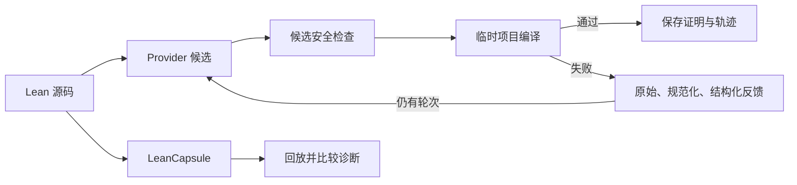

# TRACER

[English](README.md) | **简体中文**

### Typed Repair Agent with Compiler-validated Example Retrieval

**用编译反馈修复 Lean 证明，以可回放失败和可审计证据支撑实验。**

[](https://github.com/runqi-allen-wang/TRACER-Typed-Repair-Agent-with-Compiler-validated-Example-Retrieval/actions/workflows/ci.yml)
[](lean-toolchain)
[](LICENSE)

[快速开始](#快速开始) · [最新结果](#最新已发布结果) · [证据状态](PROGRESS.md) · [API 指南](docs/API_GUIDE.md) · [失败案例库](capsules/index.md) · [参与贡献](CONTRIBUTING.md)


TRACER 是面向 **Lean 4 证明修复、编译反馈实验与失败复现**的研究工具。它在目标项目环境中编译每个候选，记录逐轮诊断和检索示例，并保存成功证明供独立复编译。LeanCapsule 把失败整理成可移植、可审计的回归案例。

> TRACER 不训练或微调模型。项目研究推理阶段的证明修复，以及区分“证明编译通过”“失败被复现”和“研究结论有证据支持”所需的实验基础设施。

## 实验与安全命名体系

| 命名空间 | 含义 | 当前状态 |
| --- | --- | --- |
| **P-A / P-B / P-C** | 历史 18 题 smoke pilot；机器值为 `A/B/C` | 仅保留为工程链路证据 |
| **R-A / R-B / R-C / R-D / R-E / R-F** | repair24 的反馈与检索研究臂 | Runner 已实现；完整六臂实验尚未运行 |
| **SP-1～SP-12** | 带正常对照的编译前安全策略 | 离线策略套件已发布；操作系统隔离证据待完成 |

为兼容现有脚本和记录，研究臂的存储值仍是 `A/B/C/D/C_dynamic/C_failure`。公开讨论使用 R-A～R-F；SP 是安全策略，不是额外实验组。完整定义见[研究协议](docs/RESEARCH_PROTOCOL.md)和[安全策略](docs/security_policy.md)。

## 当前状态

- **Compiler Feedback Study v1：** 在 repair24 上发布两批经过审计的 216 任务实验，对比 raw、normalized 和 structured 诊断。发布包共有 408 个独立复编译成功的证明，并明确标注 AI 辅助复核。
- **TRACER-REAL v2：** 已冻结 6 个上游项目和 1,576 个历史候选。LeanAPAP 与 PFR 已完成全量筛查：**327 个候选、60 个纳入、267 个拒绝**。其余四项目未完成，因此纳入门禁仍禁止 provider 运行。参见 [v2 协议](docs/TRACER_REAL_V2.md)和[机器可读纳入规则](benchmarks/real_repairs/tracer_real_v2.enrollment.json)。
- **LeanCapsule：** 24 个复核案例覆盖 Std、Mathlib 与 project-local 环境；另有 12-core / 4-challenge 套件验证干净目录回放。
- **编译反馈与安全：** 三层诊断协议、[反馈采纳审计](docs/FEEDBACK_ADOPTION_V1.md)、[反馈实验协议](docs/FEEDBACK_STUDY_V1.md)和 SP-1～SP-12 门禁均已实现。容器和低权限隔离仍是待补证据。

## 快速开始

需要 Python 3.11+、Git，以及通过 `elan` 安装的 Lean。仓库在 [lean-toolchain](lean-toolchain) 中固定 Lean 版本。

```text
git clone https://github.com/runqi-allen-wang/TRACER-Typed-Repair-Agent-with-Compiler-validated-Example-Retrieval.git tracer
cd tracer
python -m pip install -r requirements.txt
lake build
```

无需调用模型 API，先回放一个失败：

```text
python -m leancapsule replay capsules/std/unknown-identifier
```

对于失败 Capsule，`ok: true` 表示预期错误成功复现，不表示 Lean 文件编译成功。

用指定的 mock 候选检查证明补丁、编译和保存链路：

```text
python src/agent.py solve --file lean_project/Benchmarks/Evaluation18.lean --theorem Eval18.and_swap_eval --condition B --provider mock --mock-candidate "by intro h; exact And.intro h.right h.left"
```

运行一次真实 DeepSeek 请求。密钥输入不会回显或写入结果；读取后**只显示字符数和末四位**。

```text
python src/agent.py solve --file lean_project/Benchmarks/Evaluation18.lean --theorem Eval18.and_swap_eval --condition B --provider openai_compatible --api-url "https://api.deepseek.com/chat/completions" --model deepseek-v4-pro --temperature 0 --max-tokens 12000 --api-key-prompt --max-rounds 3 --timeout 60
```

真实请求可能产生费用。不要把密钥写进命令、脚本、提交、Issue 或结果文件。Responses API、GPT 示例、自定义 provider、本地 HTTP 接口和故障排查见 [API 指南](docs/API_GUIDE.md)。

判断失败时应注意：`provider_error` 表示请求没有产生可用候选；编译诊断类别表示候选已经到达 Lean。`compile_ok: false` 本身不代表 API 损坏，应先检查 `diagnostic` 再决定是否重试。

## 工作原理



Agent 成功表示候选通过 Lean 和未完成证明检查；Capsule 成功表示预期编译状态与诊断被复现。两者不是同一种结果。

## 最新已发布结果

每个模型族批次包含 24 道题 × 三种反馈表示 × 三次重复，共 216 个任务实例；每个任务最多三轮。

| 模型族内批次 | 反馈表示 | 任务数 | pass@1 | 三轮内成功 |
| --- | --- | ---: | ---: | ---: |
| DeepSeek Pro | Raw | 72 | 56/72（77.8%） | 67/72（93.1%） |
| DeepSeek Pro | Normalized | 72 | 56/72（77.8%） | 65/72（90.3%） |
| DeepSeek Pro | Structured | 72 | 60/72（83.3%） | 67/72（93.1%） |
| DeepSeek Flash | Raw | 72 | 67/72（93.1%） | 69/72（95.8%） |
| DeepSeek Flash | Normalized | 72 | 63/72（87.5%） | 69/72（95.8%） |
| DeepSeek Flash | Structured | 72 | 66/72（91.7%） | 71/72（98.6%） |

证据：[Pro 发布包](published/feedback-study-8ccb89dd-3e26-47f0-8eae-d1930b95e248) · [Flash 复现包](published/feedback-study-562ad440-3446-4138-801e-59726ed0e108) · [逐任务配对比较](published/feedback-cross-model-8ccb89dd-562ad440)。

Flash + structured 是本次发布中观测值最高的一行，但这些只是同一供应商模型族内的描述性结果。两批实验的显式 reasoning 控制不同，价格未冻结，因此不能据此声称因果优势、统计显著、跨供应商泛化或 SOTA。

## 证据与边界

| 范围 | 当前有证据支持的内容 | 重要边界 |
| --- | --- | --- |
| 编译反馈实验 | 两批通过审计的 216 任务发布；408 个证明独立复编译 | AI 辅助复核；不是独立供应商复现 |
| TRACER-REAL v2 | 两个项目完成全量筛查并公开接受/拒绝账本 | 仅是纳入证据；四项目和 provider 运行尚未完成 |
| LeanCapsule | 24/24 gallery 回放、16/16 feasibility 回放 | 复现预期失败不等于修复证明 |
| 安全 | [SP v2 发布包](published/security-study-tracer-sp-v2)：危险候选误放行 0/12，正常对照误拒绝 0/8 | 小规模冻结套件不是操作系统沙箱，也不代表零风险 |

早期 [18 题 smoke pilot](published/pilot-20260826T122354Z-d628742d)仅用于工程链路追溯，不再作为主要效果证据。统一证据登记见 [PROGRESS.md](PROGRESS.md)，历史变更见 [CHANGELOG.md](CHANGELOG.md)。

## 验证

以下核心检查不会调用付费模型 API：

```text
lake build
python -m unittest discover -s tests -v
python -m leancapsule audit capsules
python -m leancapsule verify capsules
```

`audit` 检查工件结构和发布策略，`verify` 回放预期行为；两者都不能替代模型实验或数学复核。

## 关键文档

| 主题 | 文档 |
| --- | --- |
| Provider/API 配置 | [API 指南](docs/API_GUIDE.md) |
| Compiler Feedback v1 | [诊断协议](docs/COMPILER_FEEDBACK_V1.md) · [反馈采纳](docs/FEEDBACK_ADOPTION_V1.md) · [反馈实验](docs/FEEDBACK_STUDY_V1.md) |
| 因果对照与 R-A～R-F | [因果反馈](docs/CAUSAL_FEEDBACK_V1.md) · [研究协议](docs/RESEARCH_PROTOCOL.md) |
| 真实历史修复 | [TRACER-REAL 构建器](benchmarks/real_repairs/README.md) · [v2 纳入](docs/TRACER_REAL_V2.md) |
| 失败工件 | [Capsule 格式](docs/CAPSULE_FORMAT.md) · [案例库](capsules/index.md) |
| 安全 | [SP 策略](docs/security_policy.md) · [隔离协议](docs/SP_ISOLATION_V1.md) |
| 研究背景 | [相关工作](docs/RELATED_WORK.md) |

## 下一步证据

1. 筛查 TRACER-REAL v2 剩余 1,249 个冻结候选，再冻结项目均衡的最终 manifest 与运行时预注册。
2. 仅在 v2 纳入门禁开启后运行 provider，保留同首轮候选的因果分叉和项目等权分析。
3. 分别生成原生 Linux 与 Windows Docker Desktop 的 SP 隔离证据。
4. 在反馈对照和安全边界稳定后，再评估自适应路由策略。

以上均为计划，不是已完成结果。

## 引用、许可与致谢

研究或教学使用时，请引用 [CITATION.cff](CITATION.cff)，并注明仓库版本和实验批次。TRACER 采用 [MIT License](LICENSE)；各 Capsule 保留自身记录的来源许可。

感谢 [SJTU AI4Math Summer School 2026](https://sjtu-ai4math.github.io/summer-school/2026/) 提供学习与协作平台，也感谢 [subfish-zhou](https://github.com/subfish-zhou) 与 [Fulcrum-Nebula](https://github.com/Fulcrum-Nebula) 对编译反馈和 SP 研究方向提出建议。
