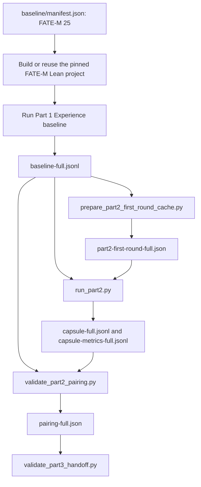

# Part 3：配对实验交接与验收清单

本文件把 Part 1 的 AxProverBase baseline、Part 2 的 CapsuleFeedback 接入，以及
`results/handoff/part12-live-20260828-corrected/` 中的正式配对结果整理成一个可复查的
Stage 3 工作流。它不新增一套独立实验目录，也不把 `Evaluation18` smoke 结果当作正式证据。

## Stage 3 问题定义

Stage 3 回答的问题是：在同一批 Lean theorem proving 任务、同一首轮候选、同一模型和同一预算下，
`CapsuleFeedback` 是否比 AxProverBase 原生 `ExperienceProcessor` 更少依赖额外 LLM 调用，并减少
失败后的修复轮数和重复编译错误。

正式对比对象：

| 条件 | Runner | 配置 | 反馈路径 |
| --- | --- | --- | --- |
| Part 1 baseline | `baseline/run_batch.py` / `baseline/run_api.py` | `configs/axprover_part1_experience.yaml` | AxProverBase `ExperienceProcessor` |
| Part 2 capsule | `baseline/run_part2.py` | `configs/axprover_part2_capsule.yaml` | `MemorylessProcessor + CapsuleFeedback` |

`Evaluation18` 只用于本地 API、Lean 和 runner smoke test。正式配对结果使用
`baseline/manifest.json` 中的 FATE-M 25 题。

## 工作流



## 必须复用的现有文件

- `baseline/manifest.json`：25 个 FATE-M 任务，15 个 core，10 个 challenge。
- `configs/axprover_yxai_gpt56_sol.yaml`：共享模型、Responses endpoint、reasoning、预算和工具配置。
- `configs/axprover_part1_experience.yaml`：Part 1 baseline memory 配置。
- `configs/axprover_part2_capsule.yaml`：Part 2 CapsuleFeedback memory 配置。
- `scripts/prepare_part2_first_round_cache.py`：从 baseline JSONL 抽取首轮候选缓存。
- `scripts/validate_part2_pairing.py`：严格检查 baseline 与 capsule 的配对一致性。
- `results/handoff/part12-live-20260828-corrected/`：当前可公开复查的 corrected handoff。

## 最小可复查命令

以下命令不调用模型 API，只检查已提交 handoff 是否满足 Stage 3 配对要求：

```bash
python scripts/validate_part3_handoff.py
```

若要重新验证底层配对报告：

```bash
python scripts/validate_part2_pairing.py \
  --baseline results/handoff/part12-live-20260828-corrected/baseline-full.jsonl \
  --capsule results/handoff/part12-live-20260828-corrected/capsule-full.jsonl \
  --out results/handoff/part12-live-20260828-corrected/pairing-full.json
```

该命令会重写 `pairing-full.json`，正式复核时应在干净工作区执行，避免把历史交接文件误改成观察后产物。

## Handoff 验收条件

`validate_part3_handoff.py` 检查：

1. `handoff.json` 标记为 FATE-M、25 paired problems、`pairing_ok=true`。
2. `handoff.json` 中登记的文件都存在，且字节数与实际文件一致。
3. `baseline-full.jsonl` 与 `capsule-full.jsonl` 都包含同一组 25 个 task id。
4. 两组记录通过 `leancapsule.pairing.validate_paired_runs`。
5. 配对报告固定 AxProverBase commit、模型、endpoint、Responses API、`store=false` 和 `reasoning_effort=high`。
6. Capsule 条件的 `memory_calls`、`capsule_llm_calls`、`capsule_compiler_calls` 均为 0。
7. `part2-first-round-full.json` 覆盖每个 paired target。
8. 汇总数字与 README/handoff 中的公开结论一致：baseline/capsule 均为 25/25 成功，轮次 39→36，编译错误 14→11，LLM calls 79→36，tokens 656657→274742。

## 报告边界

可以报告：

- 两组在 FATE-M 25 题上严格配对，且首轮候选一致。
- CapsuleFeedback 条件在该批次中没有额外 Memory LLM、Capsule 内部 LLM 或 Capsule 内部编译调用。
- 该批次的轮数、编译错误、LLM 调用和 token 总量低于 Experience baseline。

不能报告：

- 统计显著优势。25 题、单模型、单批次不足以支撑该结论。
- 通用自动定理证明能力。FATE-M 25 是固定小样本。
- Evaluation18 上的本地 smoke 数字是正式 Stage 3 证据。
- 观察后修改的协议是预注册实验设计。

## 后续扩展

下一轮 Part 3 应新建独立结果目录，保留 `plan.json`、manifest hash、配置快照、首轮候选缓存、
raw JSONL、配对报告、人工复核表和导出清单。若扩大到多模型或重复运行，比较应按 task id 聚类，
不能把重复运行当作更多独立 theorem。
